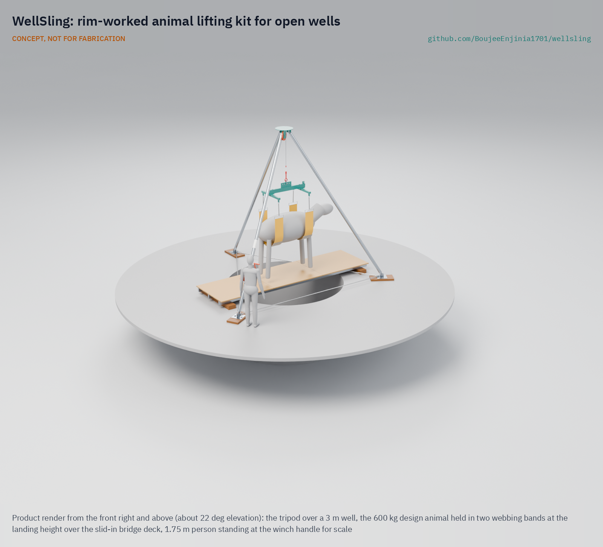

# WellSling

   

**Area:** Food and water security · **TRL:** 3 of 9 (proof of concept on paper) · **Value-engineering target:** USD 1,500 (estimated cost of the constructable design USD 3,004) · **Difficulty:** 2 of 5

Slings a fallen animal out of an open well from the rim, so nobody climbs down into bad air.

> CONCEPT, NOT FOR FABRICATION. WellSling is a TRL 3 design on paper: it has not been built or tested, and it is not certified lifting or rescue equipment.

## Concept rationale

An animal in a well can be lifted without anyone going down, if the lifting band can be passed under it from the rim. WellSling is a rim-worked kit: two plain webbing bands on a spreader, a separate passer pole that carries a light line under the animal from above, and a steel tripod with a braked hand winch to lift it. Farmers pass the bands, shackle them to the spreader and wind the animal up from the edge, then slide a small bridge across the well mouth under it and lower it onto the deck, so nobody climbs in and the animal is never swung over the rim.

Keeping it simple, open and low-cost matters because these accidents happen on small farms and in villages, far from fire services, and the people present decide within minutes. A kit kept at a village or dairy cooperative, built from webbing, poles and galvanised steel a local fabricator can make, gives them a choice other than climbing down.

## Burning platform

Going down after someone, or something, is how confined spaces kill. NIOSH found that more than 60 % of confined-space deaths are would-be rescuers ([NIOSH 86-110](https://ncsp.tamu.edu/reports/CDC/Confined%20Spaces%20Alert-DHHS%20(NIOSH)%20Publication%20No_%2086-110.htm)). In two farm incidents in the US in 1989, seven people died in manure pits, at least five of them while trying to rescue others ([CDC MMWR, 1989](https://www.cdc.gov/mmwr/preview/mmwrhtml/00001448.htm)); in one, five members of a Michigan family died one after another ([NIOSH FACE 89-46](https://stacks.cdc.gov/view/cdc/164363)).

The same chain repeats in Indian villages. In July 2026 four people died in a village in Jhajjar, Haryana, trying to rescue a calf from a well ([The Tribune, 2026](https://www.tribuneindia.com/news/haryana/four-die-trying-to-rescue-calf-from-well-in-jhajjar-village-kin-of-each-victim-to-get-41-lakh-job/)). In March 2026 four members of one family in Vaishali, Bihar, died one after another in a soak pit, which officials attributed to oxygen depletion from accumulated gases ([The Hawk, 2026](https://www.thehawk.in/news/india/family-of-four-suffocate-to-death-in-bihars-vaishali)).

## Where it could be used

### By industry

| Industry | Use |
| --- | --- |
| Smallholder dairy and livestock farming | Village or farm kit for animals fallen into open wells |
| Dairy cooperatives | Shared kit held at a collection centre and lent to members |
| Animal welfare and rescue organisations | Rescue van kit for well and pit rescues of large animals |
| Rural fire and disaster response services | Non-entry large animal lift for village call-outs |
| Village councils and water committees | Kit kept with the village alongside well safety covers |

### By country or region

| Country or region | Why it matters there |
| --- | --- |
| India (Haryana) | Four people died trying to rescue a calf from a well in a Jhajjar village in July 2026 ([The Tribune, 2026](https://www.tribuneindia.com/news/haryana/four-die-trying-to-rescue-calf-from-well-in-jhajjar-village-kin-of-each-victim-to-get-41-lakh-job/)). |
| India (Bihar) | Four family members died in sequence in a soak pit in Vaishali in March 2026 ([The Hawk, 2026](https://www.thehawk.in/news/india/family-of-four-suffocate-to-death-in-bihars-vaishali)). |
| United States (farms) | Farmers and ranchers had 79 confined-space deaths from 2011 to 2018, second only to construction laborers in that count ([BLS](https://www.bls.gov/iif/factsheets/fatal-occupational-injuries-confined-spaces-2011-19.htm)). |
| Global | More than 60 % of confined-space deaths are would-be rescuers ([NIOSH 86-110](https://ncsp.tamu.edu/reports/CDC/Confined%20Spaces%20Alert-DHHS%20(NIOSH)%20Publication%20No_%2086-110.htm)). |

## What sparked the idea

The idea came from a July 2026 report from Jhajjar district in Haryana, India: four people died trying to rescue a calf that had fallen into a well in their village ([The Tribune, 2026](https://www.tribuneindia.com/news/haryana/four-die-trying-to-rescue-calf-from-well-in-jhajjar-village-kin-of-each-victim-to-get-41-lakh-job/)). The calf was the reason anyone went down; the air in the well was what killed them. If the calf could have been lifted from the rim, nobody would have needed to go down at all.

## Problem

When a cow, buffalo or calf falls into an open well, people climb down to save it. The air at the bottom of a well can be low in oxygen or full of gas, and people die, often several in a row as each tries to rescue the last.

Full problem statement: [docs/01-problem.md](docs/01-problem.md)

## Concept

A rim-worked kit (a 600 kg tripod with a braked hand winch, two plain webbing bands on an H-frame spreader, a separate passer pole and a slide-in landing bridge); farmers pass the bands under an animal that has fallen into an open well, winch it up from the edge and land it on the bridge, so nobody climbs in.

Full design precis: [docs/02-concept.md](docs/02-concept.md) · Requirements: [docs/03-requirements.md](docs/03-requirements.md) · Calculations: [docs/04-calcs/01-sizing.md](docs/04-calcs/01-sizing.md) · Prototype build plan: [docs/05-build-plan.md](docs/05-build-plan.md) · Design decisions: [docs/06-design-decisions.md](docs/06-design-decisions.md)

## Key components

- Tripod: three 4.5 m pinned steel legs, a head with a 200 mm sheave, staked feet on timber pads, spread chains
- Hand winch, 1,000 kg, with an automatic load-pressure brake, on one leg
- H-frame spreader with two plain 240 mm webbing bands, adjusting chains and felt sleeves
- Passer pole of 2 m aluminium sections with a J-head, a retrieval hook head and messenger lines
- Landing bridge: two rim bearers, three steel runners and three plywood deck panels
- Rim harnesses for anyone within 1 m of the edge

## Key numbers (estimates, WSL-CAL-001)

- Design animal 600 kg; hook load 648 kg; proof 1.5 times; rope safety factor 6.1
- Wells up to 3 m across and 15 m deep; tripod tips only if the hook line leans 19.3 deg
- Crank force at most 196 N; a 15 m lift takes about 29 minutes with the crew taking turns
- Kit about 550 kg; heaviest piece 31.6 kg; setup about 20 minutes for three people
- Value-engineering target USD 1,500; estimated cost USD 3,004 (USD 1,504 over the target)

## Building the prototype

The [prototype build plan](docs/05-build-plan.md) (WSL-BLD-001, plan, not yet built) takes a capable fabricator through the kit component by component, with a making sketch for each of the 15 made parts, close-ups of 11 joints and a picture for each of 14 assembly steps. The steel parts are cut, drilled and welded from tube, box section and plate, then galvanised; the timber parts are sawn; the winch, rigging and bands are bought. The first assembly is done on open ground, and nothing is lifted until a proof-load test at 1.5 times the rating, which is TRL 4 work.

## Safety

> Safety-critical: involves lifting heavy loads over an open well. Published as an open engineering reference, never as certified lifting or rescue equipment.
>
> Nobody goes down the well. If a person is already in the well, call the emergency services.
>
> Keep people back from a crumbling rim; set the pads at least 650 mm back from the rim on firm ground, stake the feet and fit the spread chains.
>
> Never stand under the animal or in the path of a swinging load.
>
> A frightened animal can kick and thrash; keep hands clear of the band and legs.
>
> The kit is rated for an animal of 600 kg at most, and is not used on an animal before it has been proof-loaded to 1.5 times that rating.
>
> The animal is never swung over the rim; it is landed on the bridge deck. Anyone within 1 m of the rim wears a harness tied back to a tripod foot.
>
> This design is published as an open engineering reference. It is not certified equipment.

## Repository layout

| Folder | Contents |
| --- | --- |
| `docs/` | Problem, concept, requirements, calculations and design decisions |
| `cad/src/` | build123d Python source, the source of truth for all geometry |
| `cad/step/`, `cad/stl/` | Exported models for FreeCAD, other CAD tools and printing |
| `cad/drawings/` | 2D sketches and dimensioned drawings |
| `bom/` | Bill of materials |
| `electronics/` | KiCad schematics and PCB layouts |
| `firmware/` | Microcontroller code |
| `media/` | Renders, perspectives and photos |
| `build-log/` | Dated prototyping notes |

## Documentation

Controlled documents follow the portfolio [documentation standard](.kit/STANDARDS.md). Each carries a document ID (WSL-PRC-001 for the precis), a version and a revision history. Branded PDFs are built with `python .kit/render.py` and attached to GitHub Releases when a document is tagged, for example `WSL-PRC-001/v1.0`.

## Credits

Designed by Amish Chadha at Design Molecule Labs. See [CONTRIBUTORS.md](CONTRIBUTORS.md) for roles. To cite this design, use [CITATION.cff](CITATION.cff) (GitHub shows it as "Cite this repository").

AI assistance (Claude) was used to accelerate prototype documentation and first-pass research. Design direction and all decisions are Amish Chadha's, recorded in this repository's decision records (`docs/decisions/`).

## Licenses

- **Hardware** (CAD, drawings, BOM, electronics): [CERN-OHL-S v2](LICENSE)
- **Software** (firmware, scripts, notebooks): [MIT](LICENSE-SOFTWARE)

A project of the [Design Molecule](https://designmolecule.com) lab.
