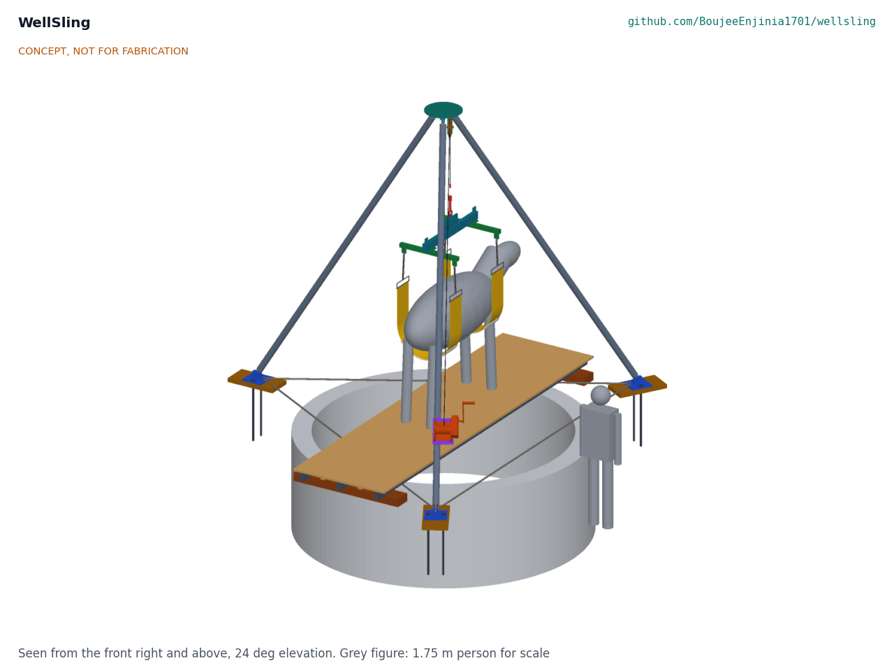
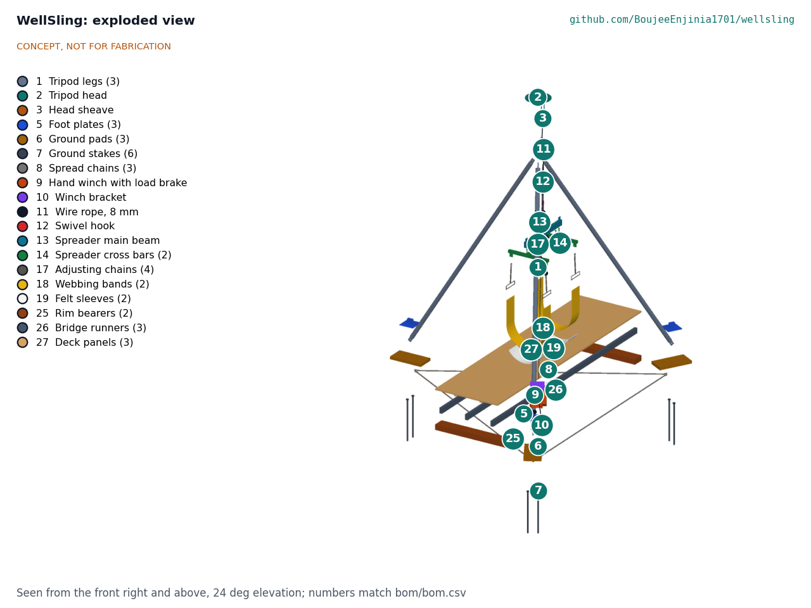
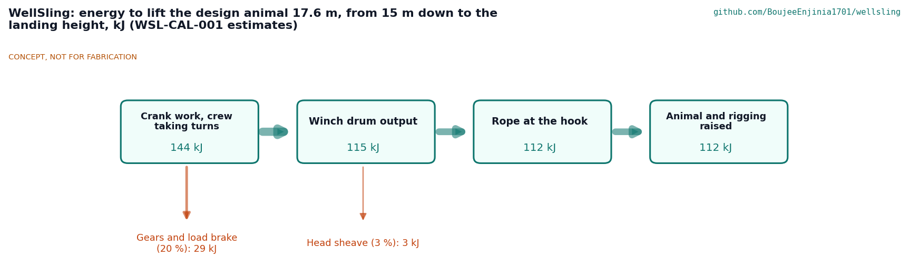

# WellSling design precis

Slings a fallen animal out of an open well from the rim, so nobody climbs down into bad air.

WellSling is a kit that a village or dairy cooperative keeps in one place: a steel tripod with a hand winch, two plain webbing bands on a spreader, a long passer pole that puts the bands under the animal from the rim, and a landing bridge that is slid across the well mouth under the lifted animal. Three or four people set it up in about 20 minutes and lift a 600 kg cow or buffalo from 15 m down without anyone going near the bottom of the well.

*Figure 1. The kit erected over a 3 m well at the landing height, with a 1.75 m person for scale.*

## How it works

1. **Set up.** The crew lays three hardwood pads on a 5 m circle around the well, at least 650 mm back from the rim, pins the three legs to the head on the ground, walks the tripod up and pins each foot to a staked foot plate. Three spread chains tie the feet together so they cannot slide outward.
2. **Pass the bands.** From the rim, one person pushes the passer pole (2 m aluminium sections and a J-shaped steel head) down beside the animal. The J goes under the body and its nose comes up the far side carrying a light messenger line. A second pole with a small hook picks the line up, and the line pulls the first band under the chest. The same is done for the flank band. Nobody goes down; anyone within 1 m of the rim wears a harness tied back to a tripod foot.
3. **Rig.** The H-frame spreader hangs from the winch hook. Each band end is shackled to a short adjusting chain at a tip of a cross bar, so the bands hang straight and do not squeeze the animal. Guide lines on both ends of the spreader keep the animal off the well wall.
4. **Lift.** The crew winds the hand winch on leg 1 at about 15 turns a minute, taking turns. The winch's load-pressure brake holds the animal whenever the handle is let go. A 15 m lift takes about half an hour.
5. **Land.** When the hooves are about 400 mm above the ground, two rim bearers are laid on each side of the well, three steel runners are pushed across under the animal, and three deck panels slide in on top. The animal is lowered onto the deck, the bands are slackened and it walks or is led off. It is never swung over the rim.

## Components

*Table 1. Main components (BOM numbers as in `bom/bom.csv`).*

| BOM | Component | Role |
| --- | --- | --- |
| 1 | Tripod legs (3) | 76.1 x 3.6 mm structural tube, 4.5 m pin to pin, pinned at both ends |
| 2 | Tripod head | 440 mm plate with three pairs of leg lugs and the sheave hangers |
| 3 | Head sheave | 200 mm sheave for the 8 mm rope, offset so the rope clears leg 1 |
| 4 | Leg pins (6) | 20 mm clevis pins with R-clips on lanyards |
| 5, 6, 7 | Foot plates, ground pads and stakes | Spread the foot load on soft ground and stop the feet moving |
| 8 | Spread chains (3) | Tie the feet together against the outward thrust of the legs |
| 9, 10 | Hand winch and bracket | 1,000 kg spur-gear winch with an automatic load-pressure brake, bolted to leg 1 |
| 11, 12 | Wire rope and swivel hook | 25 m of 8 mm rope; latched swivel hook |
| 13, 14, 15, 16 | Spreader beam, cross bars, bolts and shackles | H-frame that holds the two bands 900 mm apart and their ends about 700 mm apart |
| 17 | Adjusting chains (4) | Set the band height to suit the animal |
| 18, 19 | Webbing bands and felt sleeves | Two plain 240 mm polyester bands, chest and flank, with loose felt padding |
| 20, 21, 22 | Passer poles, J-head, retrieval hook head | Separate tool for passing the bands from the rim |
| 23, 24 | Messenger and guide lines | Pull the bands under the animal; steady the load |
| 25, 26, 27 | Rim bearers, bridge runners, deck panels | Landing bridge slid across the well under the lifted animal |
| 28 | Rim harnesses and lanyards (2) | Keep anyone near the rim from stepping past its edge |

*Figure 2. Exploded view; callout numbers match `bom/bom.csv`.*

## Key design choices

- **Its own tripod.** The scaffold borrowed the HatchSide tripod, which is rated for people. A 600 kg animal needs a frame of its own, so WellSling has a heavier tripod with pinned legs and a winch on one leg (WSL-DDR-001, D1).
- **Two bands on an H-frame.** One belly band puts all the weight on the soft belly. Two bands, under the chest and the flank, share it, and the spreader keeps the band ends apart so the bands do not squeeze the ribs (D3).
- **Land on a bridge, never swing.** Swinging a 600 kg animal sideways over a crumbling rim loads one leg of the tripod hard and puts the crew at the edge. The bridge is slid under the animal instead, so the load stays on the well axis (D5).
- **Load-pressure brake, not a worm winch.** A worm winch holds well but is too slow to crank for a 15 m lift. A spur-gear winch with an automatic load-pressure brake is fast enough and still holds the load whenever the handle is released (D6).
- **Simple workshop parts.** Everything made is cut, drilled and welded from tube, plate and box section, then galvanised, or sawn from timber; the rest is bought rigging (WSL-DDR-002).

## First-order numbers

From WSL-CAL-001, with the assumptions stated there:

- Hook load 648 kg (6.35 kN) for a 600 kg animal; proof 1.5 times.
- Rope safety factor 6.1; sheave D/d 25; winch at 85 % of its capacity on the third layer.
- Leg buckling factor 5.1 with a 10 deg lean of the hook line; the tripod would tip only at 19.3 deg.
- Spread chains at 0.86 kN each, a factor of 23 on their working load limit; ground pressure 15 kPa under a pad.
- Crank force at most 196 N; a 15 m lift takes about 29 minutes; 144 kJ of crank work (estimate), shown in Figure 3.
- Band pressure on the animal about 17 kPa average (estimate).
- Kit about 550 kg; heaviest piece 31.6 kg.
- Value-engineering target: USD 1,500. Estimated cost of the constructable design: USD 3,004 (USD 1,504 over the target).

*Figure 3. Energy to lift the design animal from 15 m down to the landing height (estimates).*

## Patent design-arounds

From the preliminary patent, trademark and prior-art screen (not legal advice), kept in the constructable design:

- Plain webbing bands only, with no stiffening insert of any kind, to stay clear of US11337406B2 (van Dongen animal harness with a stiff belly insert, active to 2039). The felt sleeves are loose padding that adds no stiffness.
- The passer is a separate tool, never built into the band (Connell Flex Guide strap guide and Nikopoulos needle noted in the screen).
- The engineering risk the screen noted, an off-centre 400 to 600 kg load on the tripod, is checked in WSL-CAL-001 sections 4 and 5.

## Shared blocks

- CalRig proof-load (proof testing tripod, band and rigging at animal loads), at TRL 4.
- The HatchSide tripod is no longer shared; see WSL-DDR-001, D1.

## Safety

> **Safety:** WellSling lifts a heavy, frightened animal over an open well. It is published as an open engineering reference, never as certified lifting or rescue equipment, and must be proof-loaded to 1.5 times its rating before any use.
>
> Nobody goes down the well. If a person is already in the well, call the emergency services; this kit is not for lifting people.
>
> Set the pads at least 650 mm and the bearers at least 350 mm back from the rim, on firm ground. Anyone within 1 m of the rim wears a harness tied back to a tripod foot.
>
> Never stand under the animal, inside the tripod legs while it is loaded, or in line with a rope or chain under load. Keep the hook line within 10 deg of vertical; use the guide lines gently.
>
> The animal is never swung over the rim. It is landed on the bridge deck.
>
> A frightened animal can kick and thrash; keep hands clear of the bands and legs, and work with a veterinarian or experienced handler where one can come.
>
> Check the pins, R-clips, shackle mousing and spread chains at every hold point in the build plan.

## Open questions

None for the design. Items that can only be settled with real parts or a veterinary partner are listed in the design decisions register, WSL-DEC-001.
