# WellSling prototype build plan

**Plan, not yet built.** How to build the first proof-of-concept prototype, component by component. Building and testing to it is TRL 4 work. Decisions and items to confirm are kept in the design decisions register ([docs/06-design-decisions.md](06-design-decisions.md)), not here.

## 1. What you are building

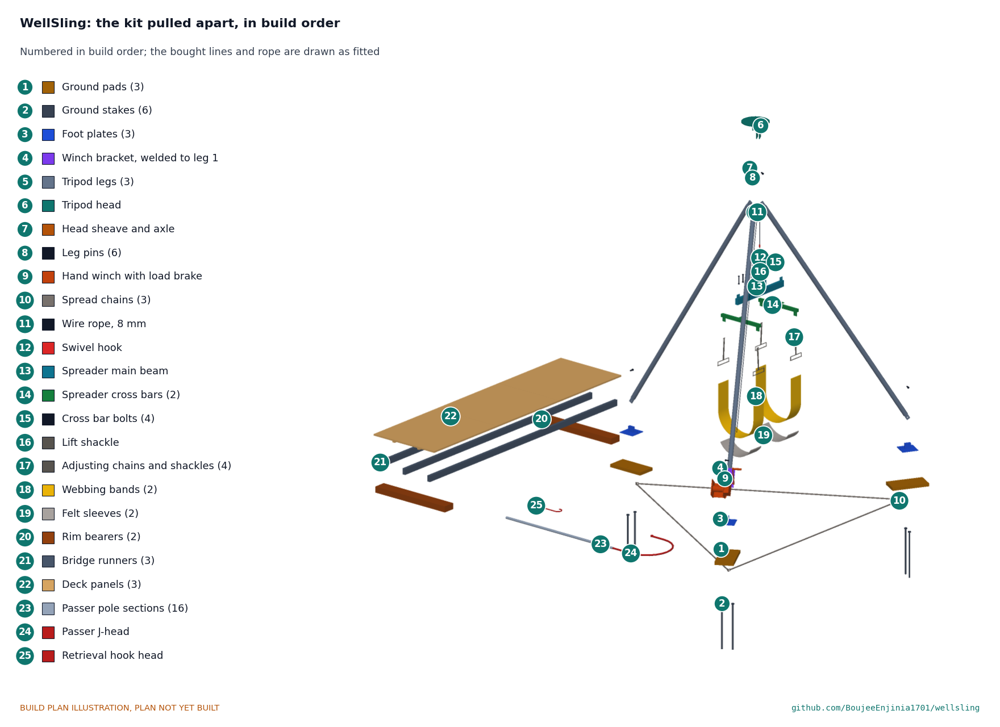

*Figure 1. Every component pulled apart and numbered in build order.*

The prototype is a kit for lifting a 600 kg cow or buffalo out of an open well up to 3 m across and 15 m deep, worked entirely from the rim. Figure 1 shows the 25 groups of parts in the order you make or fit them: three staked feet on timber pads, a tripod of three 4.5 m steel legs pinned to a head with a sheave, a hand winch on one leg, spread chains between the feet, the rope and hook, an H-frame spreader carrying two webbing bands, a passer pole for putting the bands under the animal, and a landing bridge of two bearers, three runners and three deck panels. The steel parts are cut, drilled and welded from tube, box section, plate and round bar, then hot-dip galvanised; the pads, bearers and deck are sawn timber and plywood; the winch, sheave, rope, rigging, bands, lines and harnesses are bought. Everything is pinned, bolted or shackled together at the site, and no piece weighs more than 32 kg. The parts cost about USD 3,004 from the bill of materials.

> **Safety:** WellSling lifts a heavy load over an open hole. The build involves welding, grinding, hot-dip galvanising (done by a galvaniser), raising a 4.5 m tripod and driving stakes. Assemble the prototype the first time over a 3 m circle marked on open, level ground, not over a well, and keep everyone clear of the tripod legs while it is raised. Nothing is lifted with it, and nobody uses it at a well, until it has been proof-loaded to 1.5 times its rating (the safety stops in section 6); that is TRL 4 work. Nobody ever goes down a well with this kit.

## 2. What changed to make it buildable

The concept showed what the kit does; its parts had no sections, joints or fixings. Each change keeps what the kit does and is recorded in decision record WSL-DDR-002, decided by Amish under his pre-approval of 2026-10-03.

*Table 1. Changes from the concept.*

| Component | The concept had | The buildable design has | Why |
| --- | --- | --- | --- |
| Tripod legs | A borrowed tripod | Three 76.1 mm steel tubes with welded tongues, pinned at both ends (Figures 5 and 9) | A pinned leg only pushes; it folds flat to carry |
| Head | Not defined | One weldment: a disc with three lug pairs and two sheave hangers (Figure 8) | Every pin in double shear; one piece to make |
| Rope path | Over the head | Sheave hung to one side of leg 1 so the rope runs beside the leg to the winch (Figure 10) | The rope clears every leg and drops close to the well's centre |
| Winch | On the tripod | Welded bracket on leg 1 with four bolts (Figure 11) | Crank at a height a standing person can turn |
| Feet | Leg anchors and rim pads | Foot plate on a hardwood pad, two stakes through both (Figure 5) | Spreads the load on soft ground and holds the foot |
| Spread chains | Nothing | A chain between each pair of feet (Figure 5) | The legs push outward harder than wet ground can hold |
| Spreader | A bar | H-frame: box-section beam with sleeves and a five-hole lug, two bolted cross bars (Figures 13 to 15) | Holds two bands apart; the lug holes balance the animal |
| Band ends | Clipped on | Shackle, adjusting chain and shackle through the band's sewn eye (Figure 16) | Sets the band height; nothing sewn into the band |
| Padding | Not defined | Loose felt sleeve on each band (Figure 18) | Soft padding that adds no stiffness |
| Passer | A pole with a hook | 2 m aluminium sections with spigots, a separate J-head and a retrieval hook head (Figures 19 to 23) | Carried short, made up to 16 m |
| Getting out | Swung to firm ground | Landing bridge slid under the lifted animal (Figures 24 to 27) | The animal is never swung over the rim |

## 3. Making the components

Make and check each component before the assembly step that needs it. Sizes are in millimetres. "Leg 1" is the leg that carries the winch. "Outer" means away from the well; "inner" means toward it. Workshop tolerance is 1 mm unless a step says otherwise. Weld with 3.2 mm E7018 electrodes; fillets are 6 mm unless stated. Drill a 10 mm vent hole near each end of every closed tube or box before galvanising, and send all steel parts to the galvaniser together. Mark every piece with its name in paint marker.

### 3.1 Ground pads

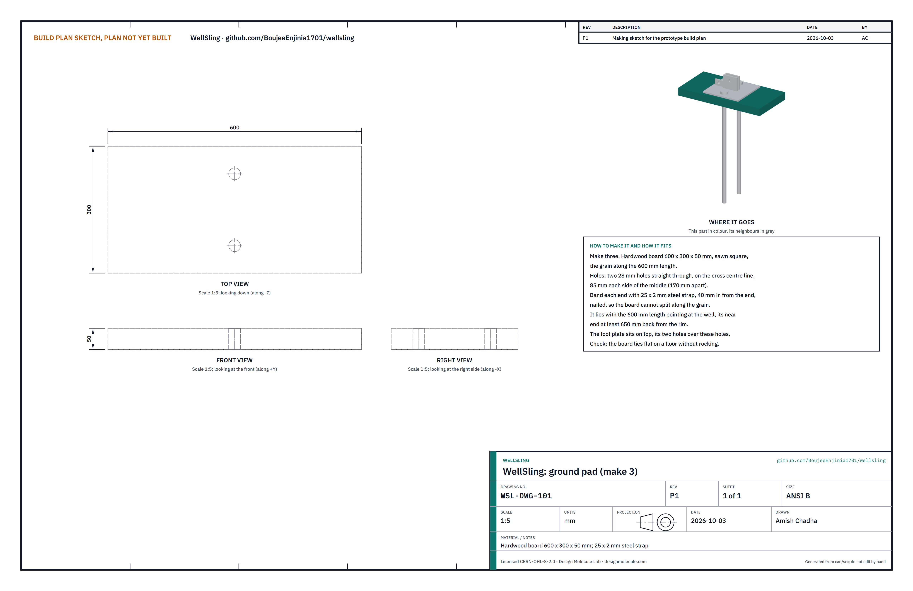

*Figure 2. Ground pad making sketch (WSL-DWG-101).*

**What it is and what it is made from.** The board each foot stands on, so the leg does not sink into soft ground. Make three from hardwood 600 x 300 x 50 mm, with 25 x 2 mm steel strap.

**How to make it.**

1. Saw three boards 600 x 300 mm, grain along the length.
2. Drill two 28 mm holes straight through on the cross centre line, 85 mm each side of the middle.
3. Band each end with steel strap 40 mm in from the end, nailed, so the board cannot split.

**How it fits the parts next to it.** It lies flat on the ground with its length pointing at the well, near end at least 650 mm back from the rim. The foot plate sits on top with its holes over the pad's holes, and two stakes go down through both (Figure 5).

**Check.** The board lies flat without rocking; a stake passes both holes.

### 3.2 Ground stakes

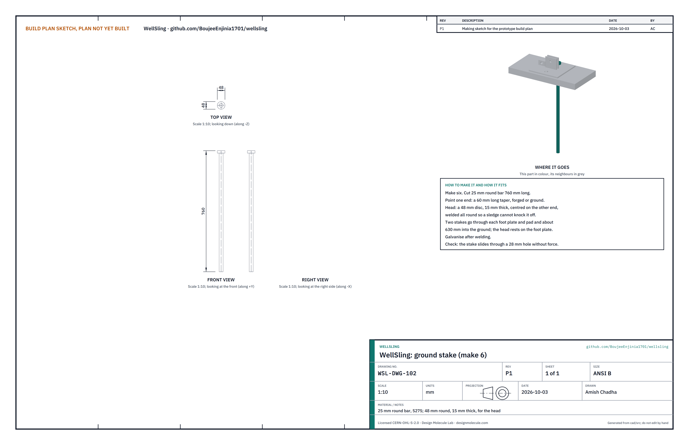

*Figure 3. Ground stake making sketch (WSL-DWG-102).*

**What it is and what it is made from.** Six pins that hold the feet in the ground. 25 mm round bar, with a 48 mm disc 15 mm thick for the head.

**How to make it.**

1. Cut six bars 760 mm long.
2. Forge or grind a 60 mm long point on one end.
3. Weld the disc centred on the other end, all round.

**How it fits the parts next to it.** Two stakes go through each foot plate and pad and about 630 mm into the ground; the head rests on the plate.

**Check.** The stake slides through a 28 mm hole without force; the head is square to the bar.

### 3.3 Foot plates

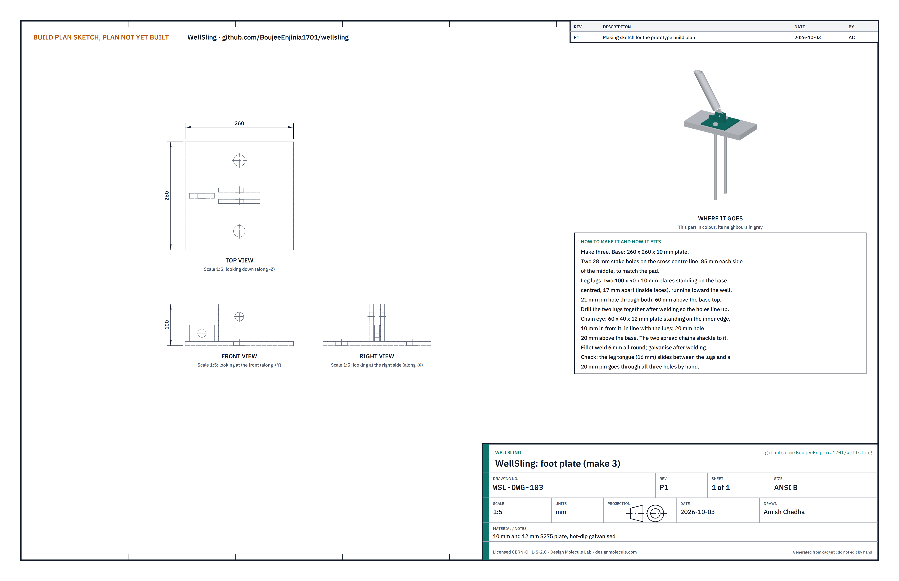

*Figure 4. Foot plate making sketch (WSL-DWG-103).*

**What it is and what it is made from.** The steel foot that each leg pins to and each spread chain pulls on. Make three from 10 mm plate (base and lugs) and 12 mm plate (chain eye).

**How to make it.**

1. Cut the base 260 x 260 mm and drill two 28 mm stake holes on its cross centre line, 85 mm each side of the middle.
2. Cut two lugs 100 x 90 mm. Weld them standing on the base, centred, 17 mm apart between their inside faces, running toward the well side.
3. Clamp the lugs together and drill one 21 mm hole through both, 60 mm above the base top.
4. Cut the chain eye 60 x 40 mm from 12 mm plate with a 20 mm hole 20 mm above its bottom edge. Weld it standing on the inner edge of the base, 10 mm in, in line with the lugs and on the same centre line.

**How it fits the parts next to it.** The 16 mm tongue at the bottom of a leg sits between the two lugs with about half a millimetre each side, and one 20 mm pin goes through all three holes. The chain eye takes the shackles of the two spread chains that meet at this foot (Figure 5).

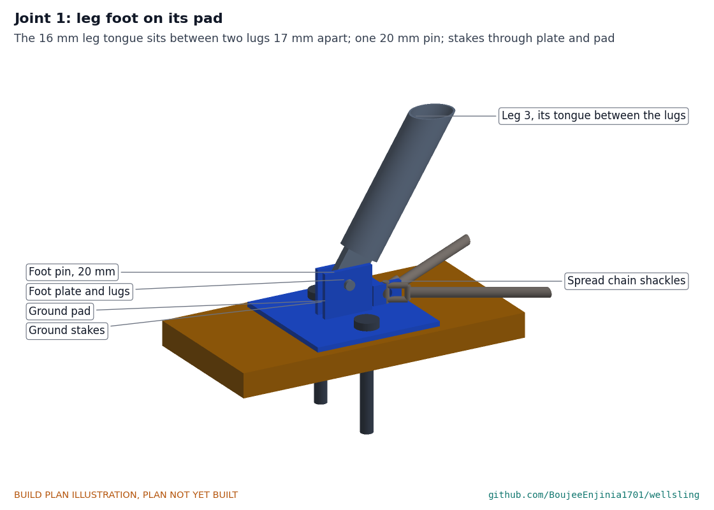

*Figure 5. The foot joint: pad, foot plate, stakes, leg tongue, pin and spread chain shackles.*

**Check.** A leg tongue slides between the lugs and a 20 mm pin goes through by hand.

### 3.4 Winch bracket

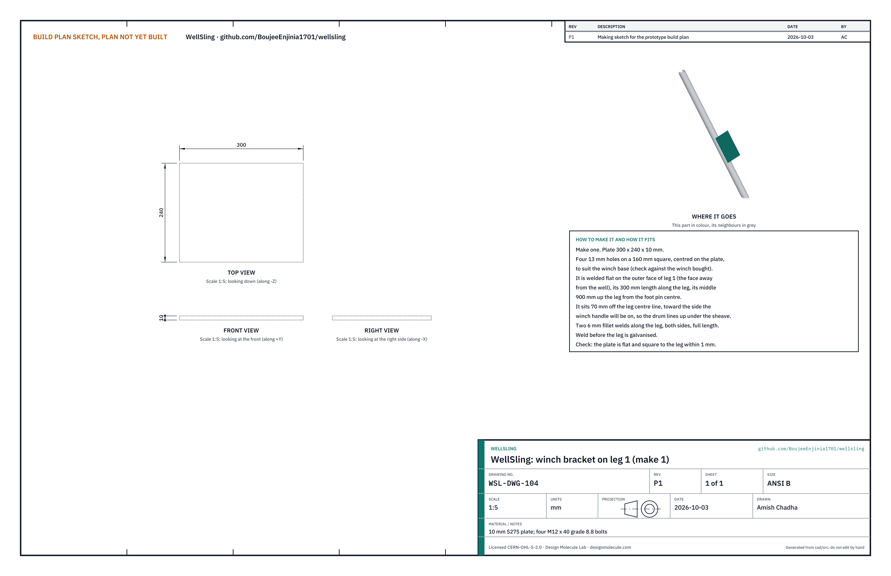

*Figure 6. Winch bracket making sketch (WSL-DWG-104).*

**What it is and what it is made from.** The plate the winch bolts to, welded onto leg 1. 10 mm plate 300 x 240 mm.

**How to make it.**

1. Cut the plate and drill four 13 mm holes on a 160 mm square, centred. Check the pattern against the base of the winch you have bought and change it to suit.
2. Weld it to leg 1 before the leg is galvanised (section 3.5).

**How it fits the parts next to it.** It lies flat on the outer face of leg 1, the face away from the well, its 300 mm length along the leg and its middle 900 mm up the leg from the foot pin centre. It sits 70 mm to one side of the leg's centre line, the side the winch handle will be on, so the drum lines up under the sheave. Two 6 mm fillet welds run the full 300 mm along the leg, one each side.

**Check.** The plate is flat and square to the leg within 1 mm.

### 3.5 Tripod legs

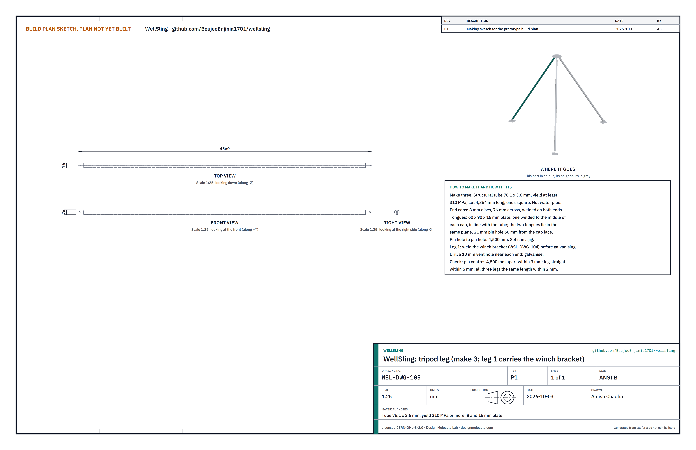

*Figure 7. Tripod leg making sketch (WSL-DWG-105).*

**What it is and what it is made from.** The three legs. Structural steel tube 76.1 x 3.6 mm with a yield strength of at least 310 MPa (not water pipe), 8 mm plate for the end caps and 16 mm plate for the tongues.

**How to make it.**

1. Cut three tubes 4,364 mm long with square ends.
2. Weld an 8 mm disc, 76 mm across, over each end.
3. Cut six tongues 60 x 90 mm from 16 mm plate, each with a 21 mm hole 60 mm from one end.
4. Set a leg in a jig with the two pin centres 4,500 mm apart and both tongues in the same plane. Weld each tongue to the middle of its end cap, in line with the tube.
5. On leg 1 only, weld the winch bracket (section 3.4).
6. Drill the vent holes and galvanise.

**How it fits the parts next to it.** The top tongue pins between a pair of lugs under the head (Figure 9); the bottom tongue pins between the lugs of a foot plate (Figure 5).

**Check.** Pin centres 4,500 mm apart within 3 mm; the leg straight within 5 mm; the three legs the same length within 2 mm.

### 3.6 Tripod head

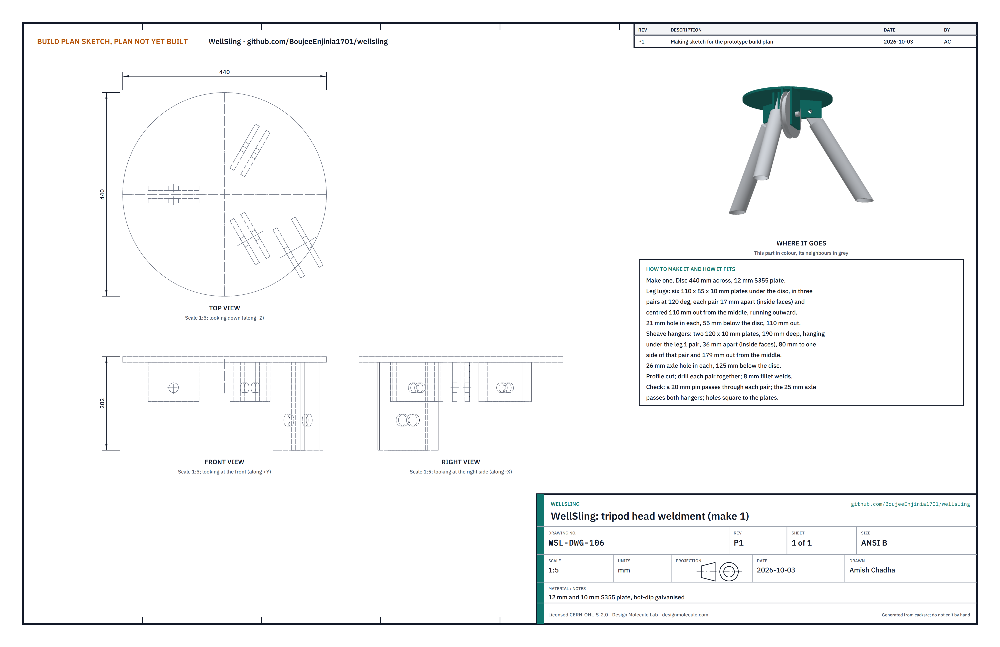

*Figure 8. Tripod head making sketch (WSL-DWG-106).*

**What it is and what it is made from.** The top of the tripod: it joins the legs and carries the sheave. A disc of 12 mm plate and lugs and hangers of 10 mm plate, S355, profile cut if you can.

**How to make it.**

1. Cut a disc 440 mm across.
2. Cut six lugs 110 x 85 mm. Weld them under the disc in three pairs at 120 deg to each other, each pair 17 mm apart between inside faces, centred 110 mm out from the middle and running outward.
3. Drill each pair together: a 21 mm hole 55 mm below the disc and 110 mm out from the middle.
4. Cut two sheave hangers 120 x 190 mm. Weld them hanging under the disc beside the pair for leg 1: 36 mm apart between inside faces, centred 80 mm to one side of that pair and 179 mm out from the middle. Use the side the winch bracket is on.
5. Drill both hangers together: a 26 mm hole 125 mm below the disc.
6. Galvanise.

**How it fits the parts next to it.** Each leg's top tongue goes between a pair of lugs and one 20 mm pin holds it, with an R-clip on a lanyard (Figure 9). The sheave sits between the two hangers on its axle (Figure 10).

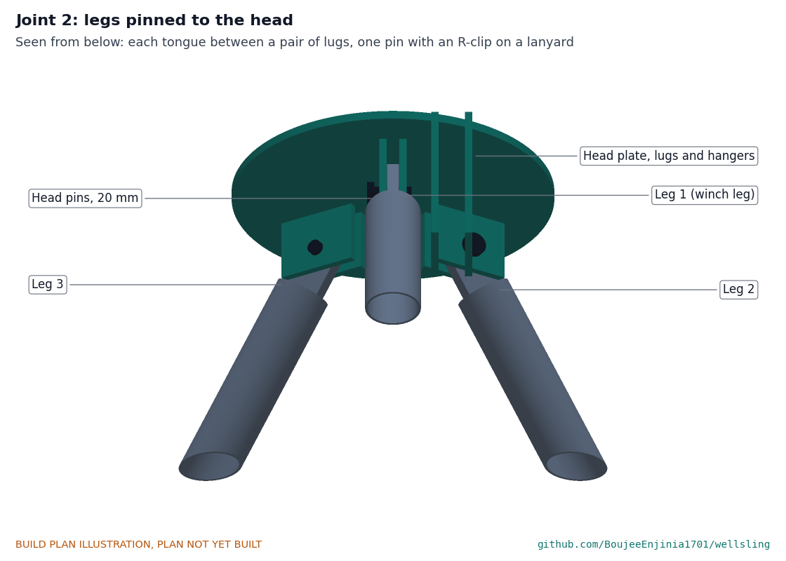

*Figure 9. The head joint seen from below: three tongues in three lug pairs, one pin each.*

**Check.** A 20 mm pin passes through each pair; a 25 mm bar passes through both hanger holes.

### 3.7 Head sheave and axle (bought)

Buy a steel sheave for 8 mm wire rope, 200 mm pitch diameter, 230 mm over the flanges and 30 mm wide, bronze bushed, with a 25 mm axle pin, nut, split pin and two 3 mm spacer washers. Fit it between the hangers with a spacer each side (Figure 10). It must turn freely by hand with no side play beyond the spacers.

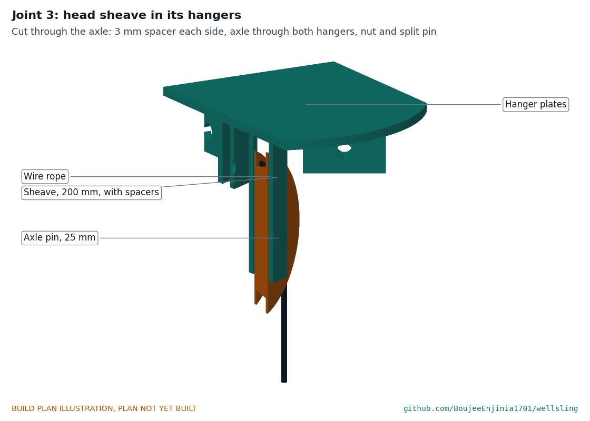

*Figure 10. The sheave between its hangers, cut through the axle.*

### 3.8 Leg pins (bought)

Buy six 20 mm clevis pins of grade 8.8 steel or better with a 70 mm grip, a head, an R-clip and a lanyard. Fix each lanyard to its lug or foot plate so a pin cannot be lost.

### 3.9 Hand winch (bought)

Buy a spur-gear hand winch rated 1,000 kg on the first layer, with an automatic load-pressure brake that holds the load whenever the handle is let go, a drum for at least 25 m of 8 mm rope, a 300 mm crank and a base for four M12 bolts. Do not use a worm-gear winch: it is too slow for a 15 m lift. Bolt it to the bracket on leg 1 with four M12 x 40 grade 8.8 bolts, nyloc nuts and washers, the handle on the side away from the leg (Figure 11).

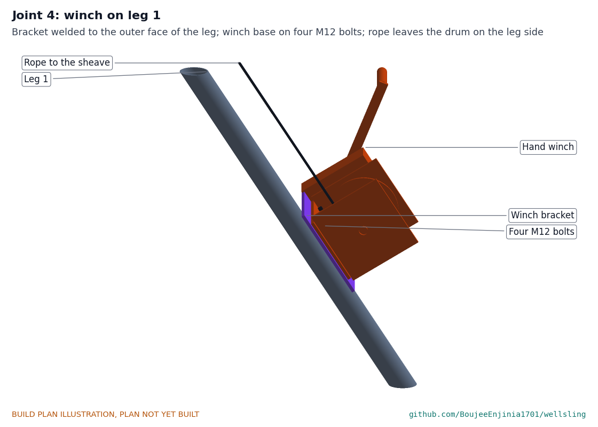

*Figure 11. The winch bolted to its bracket on leg 1; the rope leaves the drum on the leg side.*

### 3.10 Spread chains (bought)

Buy three sets of 8 mm grade 80 chain, 4.3 m between shackles, each with two 2 t bow shackles. Each set joins the chain eyes of two feet (Figure 5). Mouse every shackle pin with soft wire.

### 3.11 Wire rope and swivel hook (bought)

Buy 25 m of 8 mm galvanised wire rope, 6 x 19 with a steel core, grade 1770, minimum breaking load at least 40 kN, with a hard thimble eye and pressed ferrule at one end; and a grade 80 swivel eye hook with a working load limit of at least 1 t and a sprung latch. Fix the plain end to the drum as the winch maker says, with at least three dead turns left on the drum at the deepest lift. The hook goes on the thimble eye; a 3.25 t bow shackle joins the hook to the spreader (Figure 12).

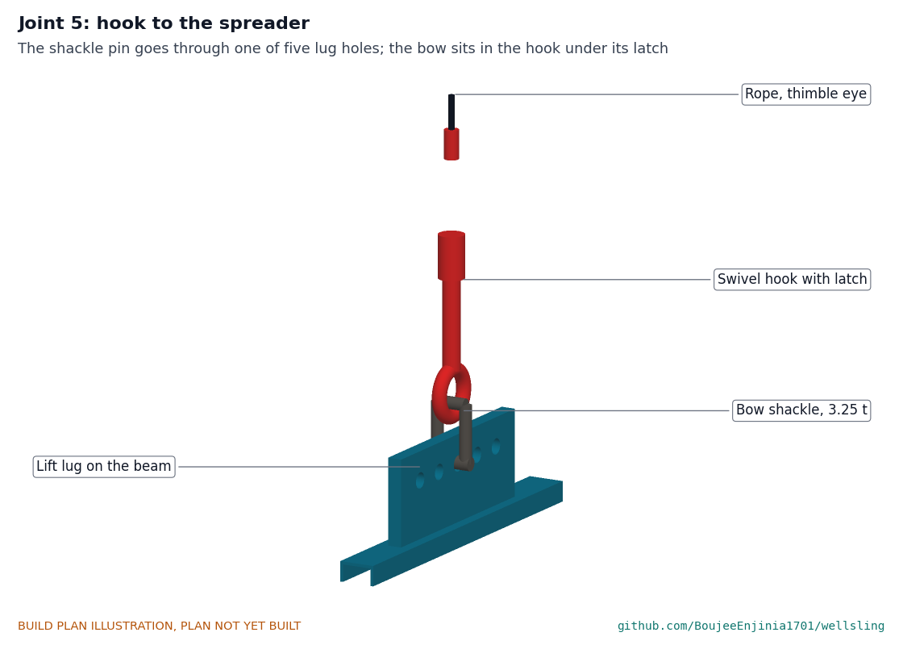

*Figure 12. Rope eye, swivel hook and lift shackle in the spreader's lift lug.*

### 3.12 Spreader main beam

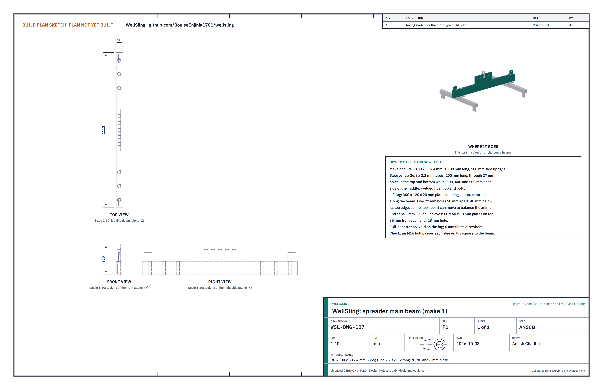

*Figure 13. Spreader main beam making sketch (WSL-DWG-107).*

**What it is and what it is made from.** The beam the hook lifts; it carries the two cross bars. Box section 100 x 50 x 4 mm, S355; tube 26.9 x 3.2 mm for sleeves; 20 mm plate for the lift lug; 10 mm and 6 mm plate.

**How to make it.**

1. Cut the box section 1,100 mm long. It is used with its 100 mm side upright.
2. Drill 27 mm holes through the top and bottom walls at 300, 400 and 500 mm each side of the middle. Push a 100 mm length of the small tube through each pair and weld it flush top and bottom.
3. Cut the lift lug 300 x 120 mm from 20 mm plate with five 22 mm holes 50 mm apart, 40 mm below its top edge. Weld it standing on top of the beam, centred and along it, with a full-penetration weld.
4. Weld 6 mm end caps, and a 60 x 60 x 10 mm guide line eye with an 18 mm hole on top, 35 mm from each end.
5. Galvanise.

**How it fits the parts next to it.** The lift shackle goes through the middle lug hole to start; moving it one hole either way balances an animal that hangs nose or tail down. Each cross bar hangs under the beam on two M16 bolts through a pair of sleeves (Figure 15).

**Check.** An M16 bolt passes every sleeve; the lug is square to the beam.

### 3.13 Spreader cross bars

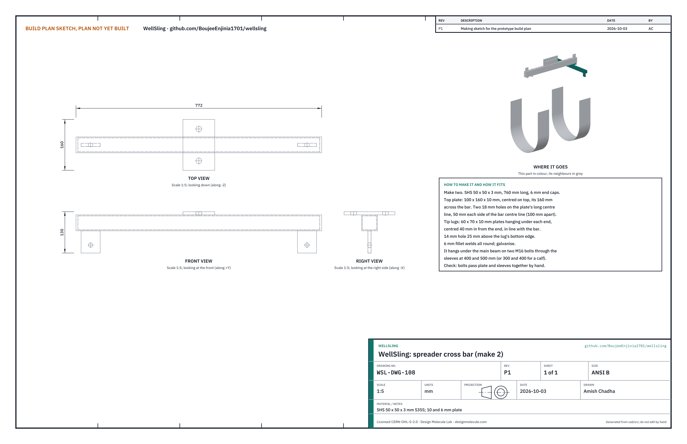

*Figure 14. Spreader cross bar making sketch (WSL-DWG-108).*

**What it is and what it is made from.** The two short bars across the ends of the beam that hold each band's two ends apart. Make two from square section 50 x 50 x 3 mm, S355, with 10 mm and 6 mm plate.

**How to make it.**

1. Cut the square section 760 mm long and weld 6 mm end caps.
2. Cut a top plate 100 x 160 mm with two 18 mm holes 100 mm apart on its long centre line. Weld it centred on top, its 160 mm length across the bar, so the holes sit 50 mm each side of the bar.
3. Cut two tip lugs 60 x 70 mm with a 14 mm hole 25 mm above the bottom edge. Weld one hanging under each end, centred 40 mm in from the end and in line with the bar.
4. Galvanise.

**How it fits the parts next to it.** The top plate sits under the beam, and two M16 x 160 grade 8.8 bolts go down through the sleeves at 400 and 500 mm and through the plate, with a washer under the head, a washer and a nyloc nut under the plate (Figure 15). For a calf, use the sleeves at 300 and 400 mm to bring the bands closer.

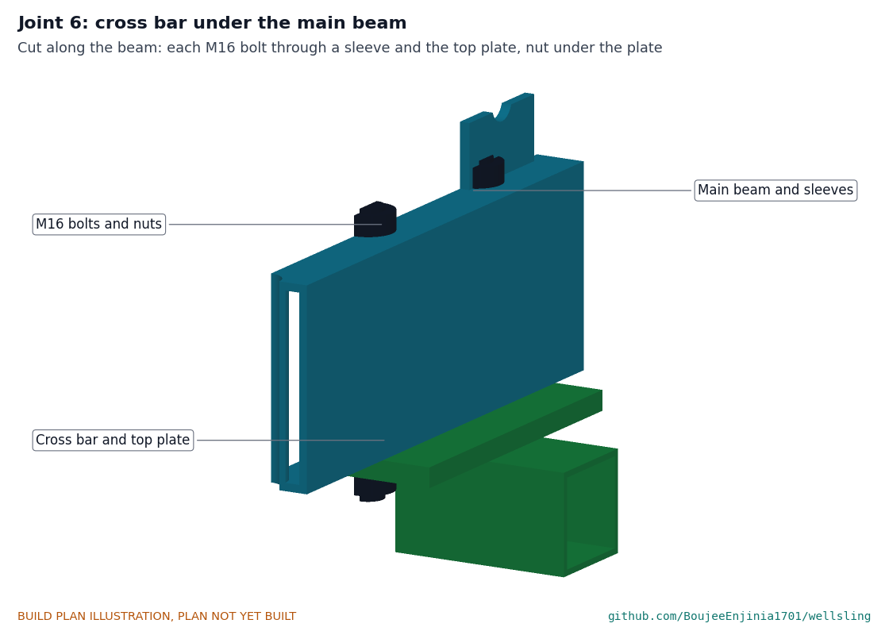

*Figure 15. The cross bar joint, cut along the beam: bolts through the sleeves and the top plate.*

**Check.** The bolts pass plate and sleeves together by hand; the tip lug holes line up along the bar.

### 3.14 Shackles and adjusting chains (bought)

Buy eight 1 t bow shackles with 11 mm pins, one 3.25 t bow shackle with a 19 mm pin, and four 1.0 m lengths of 8 mm grade 80 chain. At each cross bar tip, a shackle through the tip lug holds a chain; a second shackle through the bottom link of the chain goes through the flat sewn eye of a band (Figure 16). Use 300 mm to 1,000 mm of chain between shackles to set the band height. Mouse every pin.

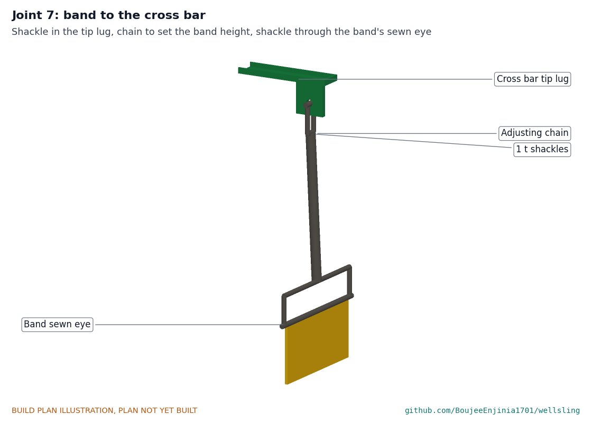

*Figure 16. The band hangs from the tip lug on a shackle, a chain and a second shackle through its sewn eye.*

### 3.15 Webbing bands (bought)

Buy two plain polyester flat webbing slings, 240 mm wide, two-ply, 2.0 m effective length, with flat sewn eyes at both ends and no stiffening insert of any kind. One goes under the chest and one under the flank.

### 3.16 Felt sleeves

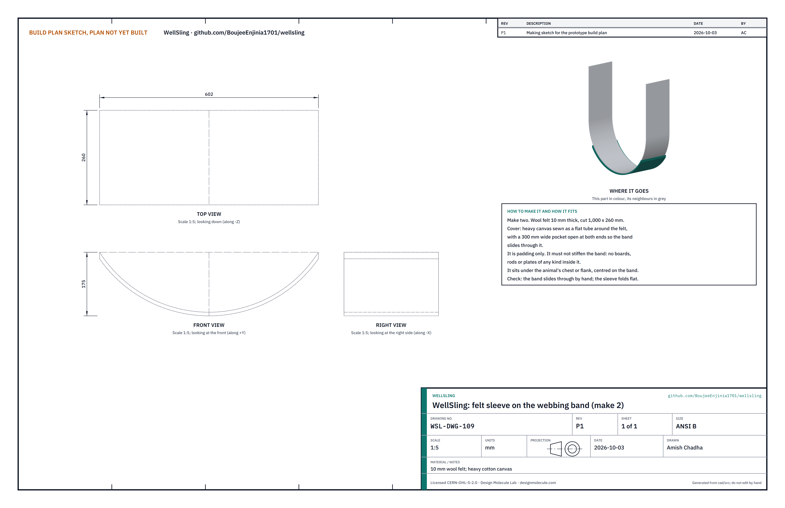

*Figure 17. Felt sleeve making sketch (WSL-DWG-109).*

**What it is and what it is made from.** Soft padding between each band and the animal. Make two from 10 mm wool felt and heavy cotton canvas.

**How to make it.**

1. Cut the felt 1,000 x 260 mm.
2. Sew a canvas cover around it as a flat tube, with a 300 mm wide pocket open at both ends for the band.

**How it fits the parts next to it.** It slides loose on the band and is centred under the animal (Figure 18). It is padding only: no boards, rods or plates of any kind go inside it.

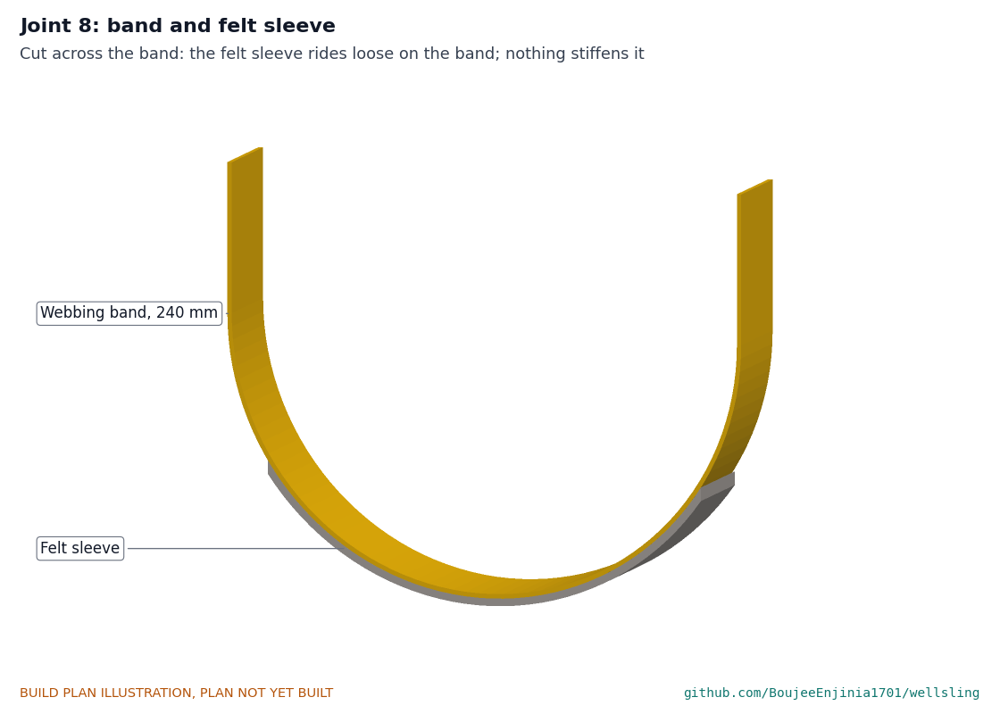

*Figure 18. The felt sleeve riding loose on the band, cut across.*

**Check.** The band slides through by hand and the sleeve folds flat.

### 3.17 Passer pole sections

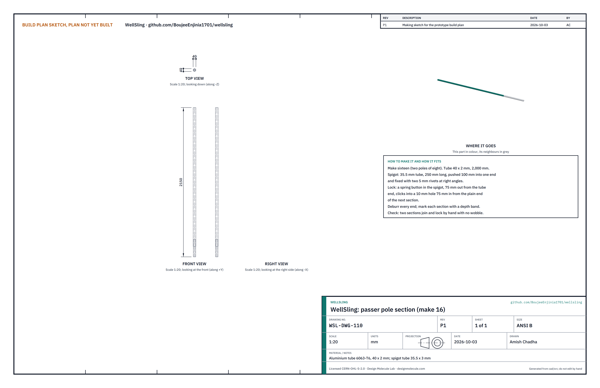

*Figure 19. Passer pole section making sketch (WSL-DWG-110).*

**What it is and what it is made from.** The long pole that reaches down beside the animal. Make sixteen sections (two poles of eight) from aluminium tube 40 x 2 mm, grade 6063-T6, with 35.5 mm tube for the spigots.

**How to make it.**

1. Cut sixteen tubes 2,000 mm long and deburr the ends.
2. Push a 250 mm spigot 100 mm into one end of each and fix it with two 5 mm rivets at right angles.
3. Fit a spring button in the spigot 75 mm out from the tube end, and drill a 10 mm hole 75 mm in from the plain end of each tube for the next button.
4. Paint a band on each section so the crew can count the depth.

**How it fits the parts next to it.** The spigot of one section goes 150 mm into the plain end of the next until the button clicks out through the hole (Figure 20).

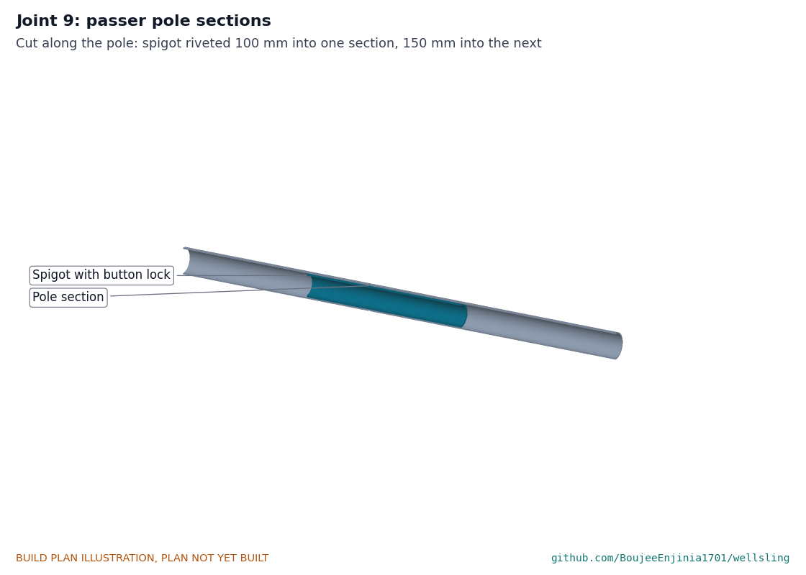

*Figure 20. Two sections joined, cut along the pole to show the spigot.*

**Check.** Two sections join and lock by hand with no wobble.

### 3.18 Passer J-head

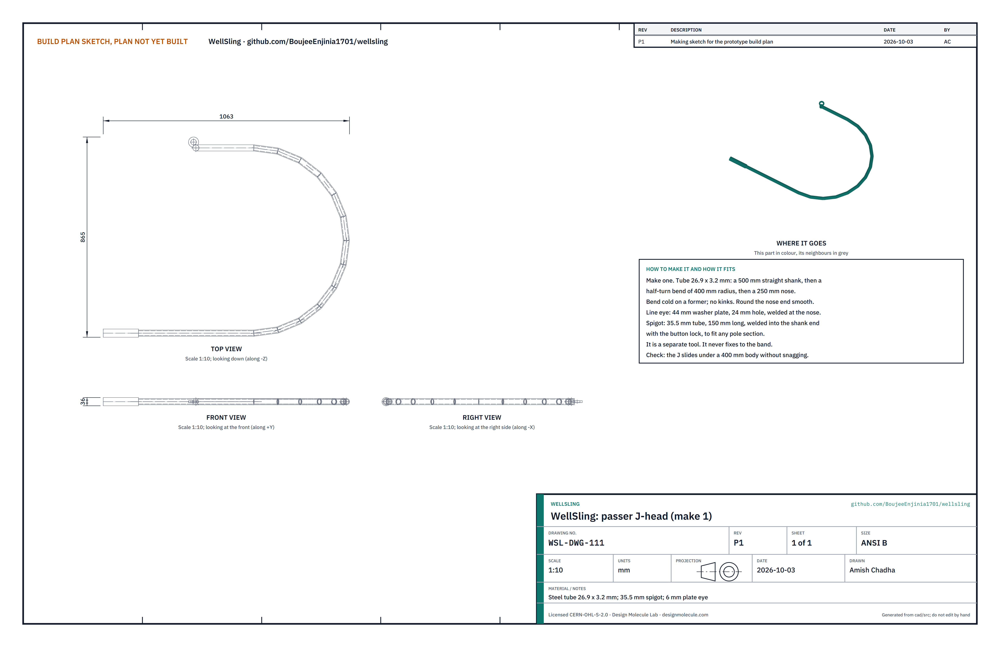

*Figure 21. Passer J-head making sketch (WSL-DWG-111).*

**What it is and what it is made from.** The hooked end that goes under the animal and brings the messenger line up the far side. Steel tube 26.9 x 3.2 mm, a 35.5 mm spigot and a small plate eye.

**How to make it.**

1. Bend the tube cold on a former: 500 mm straight, a half turn of 400 mm radius, then 250 mm straight for the nose. No kinks.
2. Round the nose end smooth and weld on a 44 mm washer plate with a 24 mm hole for the line.
3. Weld a 150 mm spigot with a button lock into the straight end.
4. Galvanise.

**How it fits the parts next to it.** It clicks onto the bottom section of a made-up pole like any other section (Figure 22). It is a separate tool and is never fixed to a band.

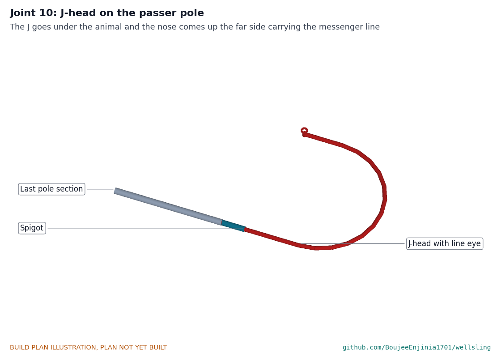

*Figure 22. The J-head on the last pole section, with its line eye at the nose.*

**Check.** The J slides under a 400 mm round dummy body without snagging.

### 3.19 Retrieval hook head

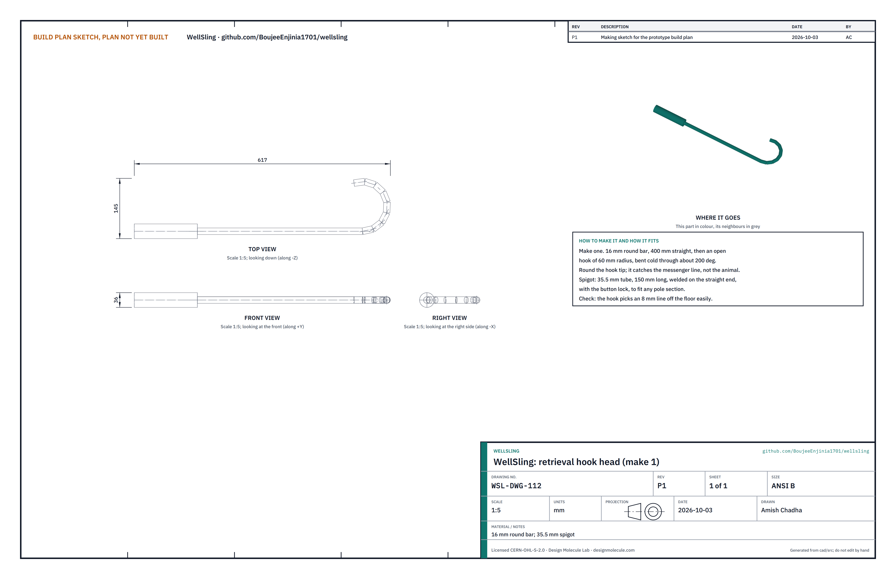

*Figure 23. Retrieval hook head making sketch (WSL-DWG-112).*

**What it is and what it is made from.** The head of the second pole, which picks up the messenger line on the far side of the animal. 16 mm round bar and a 35.5 mm spigot.

**How to make it.**

1. Bend the bar cold: 400 mm straight, then an open hook of 60 mm radius through about 200 deg. Round the tip.
2. Weld a 150 mm spigot with a button lock on the straight end and galvanise.

**How it fits the parts next to it.** It clicks onto the second pole. It catches the line, never the animal.

**Check.** The hook picks an 8 mm line off a floor easily.

### 3.20 Messenger and guide lines (bought)

Buy two 35 m lengths of 8 mm braided polyester line (messenger lines) and two 25 m lengths of 12 mm three-strand polyester rope (guide lines). Whip all ends. A messenger line is tied through the J-head's eye and later to a band's sewn eye; a guide line is tied to each guide line eye on the beam.

### 3.21 Rim bearers

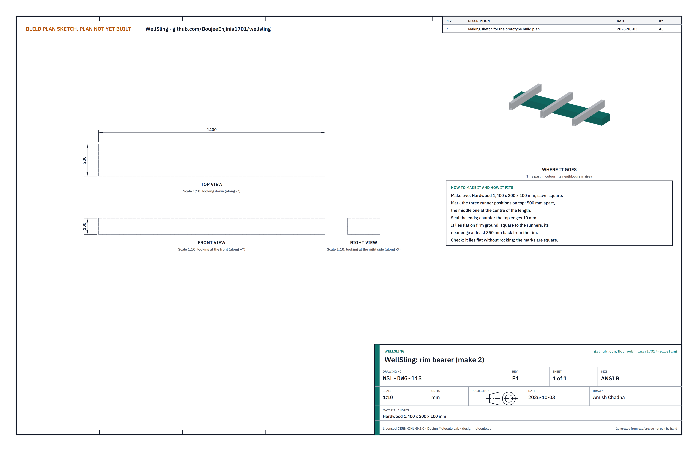

*Figure 24. Rim bearer making sketch (WSL-DWG-113).*

**What it is and what it is made from.** The two beams the bridge runners rest on, one each side of the well. Hardwood 1,400 x 200 x 100 mm.

**How to make it.**

1. Saw two beams to size, chamfer the top edges 10 mm and seal the ends.
2. Mark three runner positions on top, 500 mm apart, the middle one at the centre.

**How it fits the parts next to it.** It lies flat on firm ground, square to the runners, its near edge at least 350 mm back from the rim and its centre 2.0 m from the well's centre (Figure 27).

**Check.** It lies flat without rocking; the marks are square to its length.

### 3.22 Bridge runners

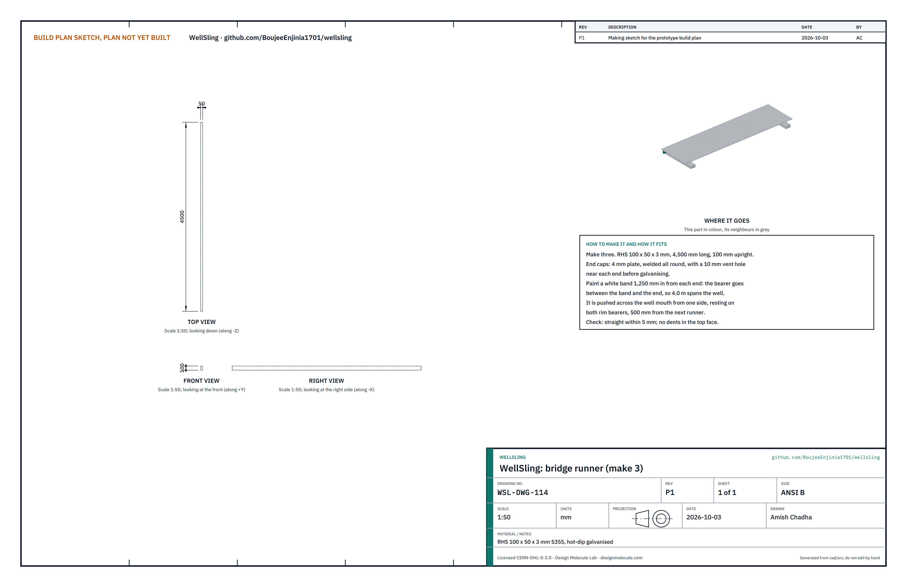

*Figure 25. Bridge runner making sketch (WSL-DWG-114).*

**What it is and what it is made from.** The three beams that span the well mouth under the lifted animal. Box section 100 x 50 x 3 mm, S355, 4,500 mm long.

**How to make it.**

1. Cut three lengths 4,500 mm with square ends and weld 4 mm end caps.
2. Drill vent holes and galvanise.
3. Paint a white band 1,250 mm in from each end.

**How it fits the parts next to it.** Each runner is pushed across the well from one side, 100 mm side upright, and rests on both bearers between its white bands and its ends, so that 4.0 m spans the well. The runners lie 500 mm apart on the bearer marks.

**Check.** Straight within 5 mm; no dents in the top face.

### 3.23 Deck panels

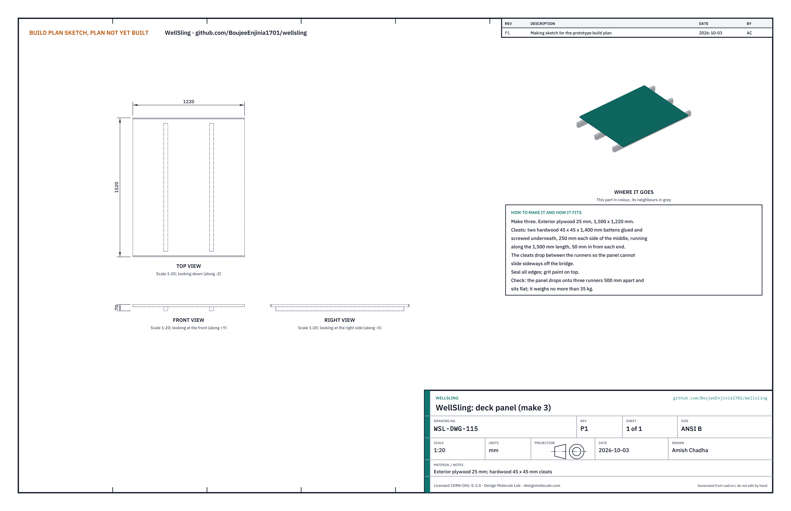

*Figure 26. Deck panel making sketch (WSL-DWG-115).*

**What it is and what it is made from.** The floor the animal is lowered onto. Make three from 25 mm exterior plywood 1,500 x 1,220 mm and hardwood battens 45 x 45 mm.

**How to make it.**

1. Cut the plywood to size and seal every edge.
2. Glue and screw two battens 1,400 mm long underneath, 250 mm each side of the middle, along the 1,500 mm length and 50 mm in from each end.
3. Grit-paint the top.

**How it fits the parts next to it.** The panel lies on the three runners with its battens dropping between them, so it cannot slide sideways off the bridge (Figure 27). Three panels end to end cover the full 4.5 m.

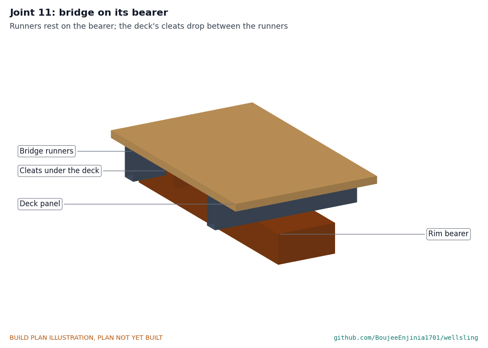

*Figure 27. Runners on a rim bearer; the deck's cleats drop between the runners.*

**Check.** The panel drops onto three runners 500 mm apart and sits flat; it weighs no more than 35 kg.

### 3.24 Rim harnesses and lanyards (bought)

Buy two full-body harnesses with front and rear attachment points and two adjustable 2 m work-restraint rope lanyards. In use, each lanyard is tied to the chain eye of the nearest foot and shortened so the wearer cannot step past the rim edge.

## 4. Putting it together

The first assembly is done over a 3 m circle marked on open, level ground. Steps 1 to 9 build and rig the tripod; step 10 shows how the bands hang once they have been passed under an animal; steps 11 to 13 build the landing bridge; step 14 makes up the passer pole. In each picture the parts already fitted are grey and the parts being fitted are in colour, pulled back along the way they go in.

### Step 1: ground pads

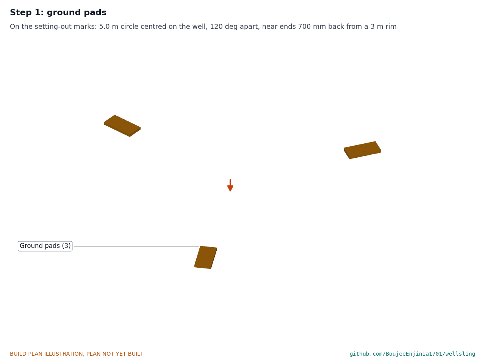

*Figure 28. Step 1: the three ground pads.*

Mark a 5.0 m circle centred on the well (or the marked circle) and three points on it 120 deg apart, with leg 1's point on the side where the crew will stand to crank. Lay a pad at each point, its length pointing at the centre and its near end at least 650 mm back from the rim.

### Step 2: foot plates and stakes

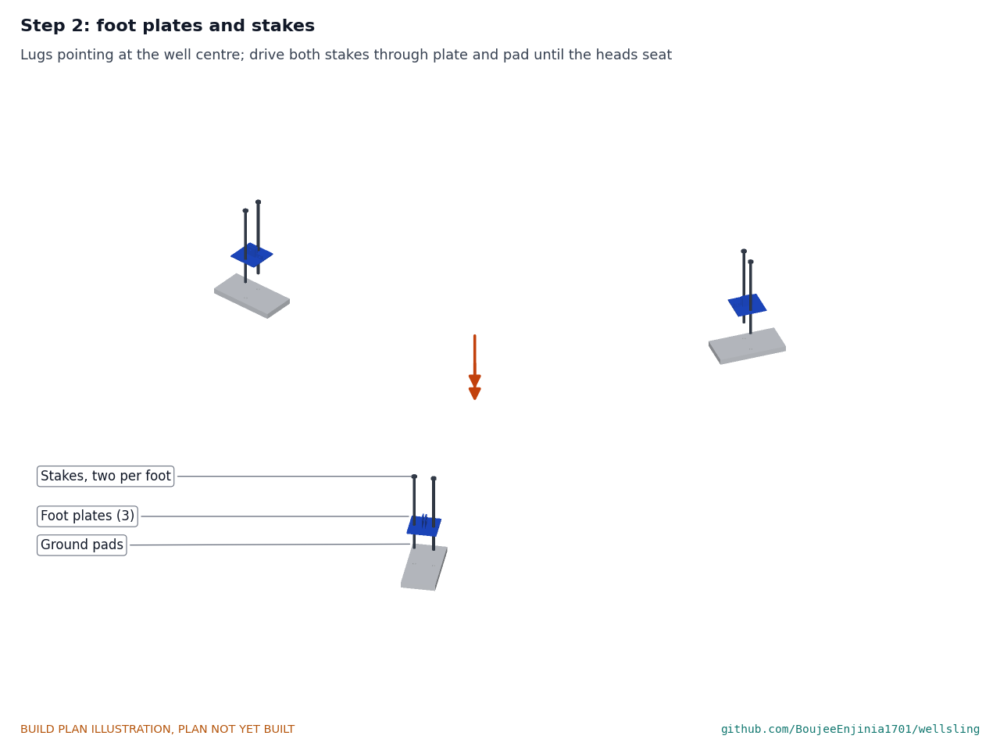

*Figure 29. Step 2: foot plates and stakes.*

Set a foot plate on each pad with its lugs pointing at the centre and its holes over the pad's holes. Drive both stakes through plate and pad until their heads seat.

**Hold point.** Every stake fully driven; every plate flat on its pad.

### Step 3: sheave into the head

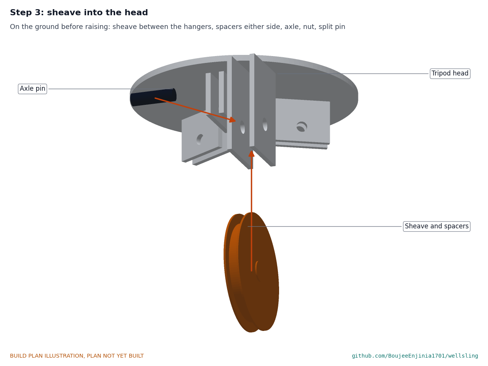

*Figure 30. Step 3: sheave and axle into the head, on the ground.*

With the head on the ground, set the sheave between the hangers with a spacer washer each side, push the axle through, fit the nut and split pin. Spin the sheave by hand.

### Step 4: winch onto leg 1

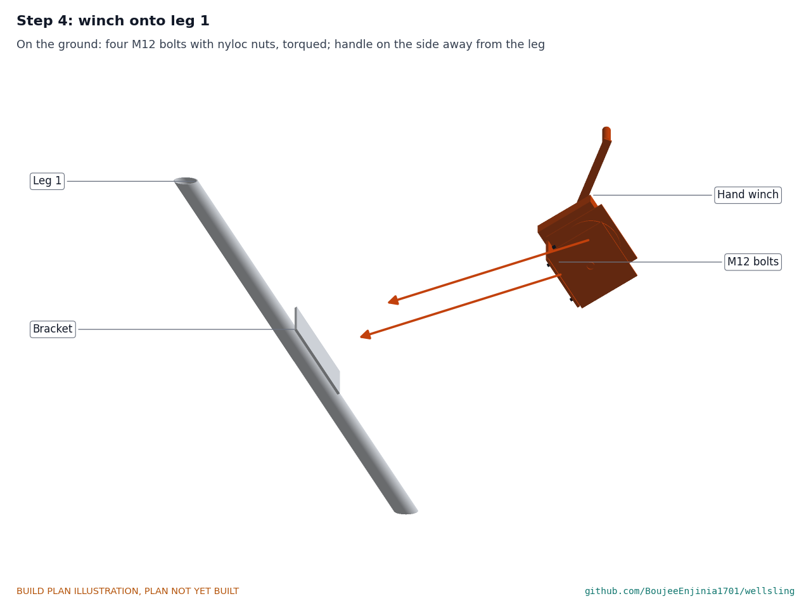

*Figure 31. Step 4: the winch onto the bracket on leg 1, on the ground.*

With leg 1 on trestles, bolt the winch to the bracket with four M12 bolts, washers and nyloc nuts, the handle on the side away from the leg. Wind the rope onto the drum, leaving the eye end free.

### Step 5: legs pinned to the head, tripod raised

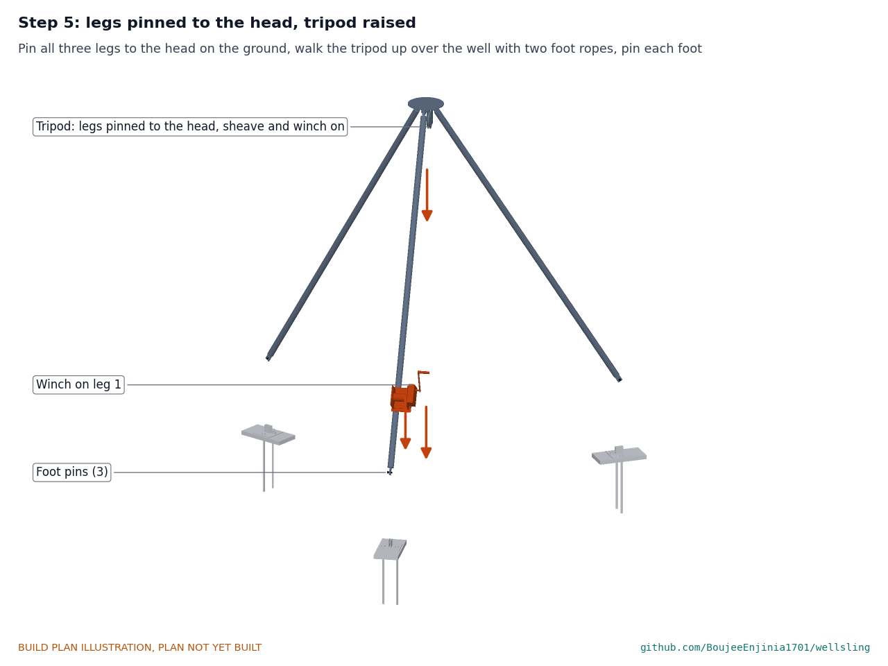

*Figure 32. Step 5: the legs pinned to the head and the tripod raised onto its feet.*

Lay the three legs on the ground like a star with their tops together, and pin each top tongue into its lug pair under the head with an R-clip. Reeve the rope over the sheave now, as step 7 describes. Pin the foot of leg 2 to its foot plate. With one person on a foot rope at each of the other two legs and two people lifting the head, walk the tripod up over the circle, then pin legs 1 and 3 to their foot plates.

**Hold point.** All six pins in and clipped; nobody inside the legs while the tripod is raised.

### Step 6: spread chains

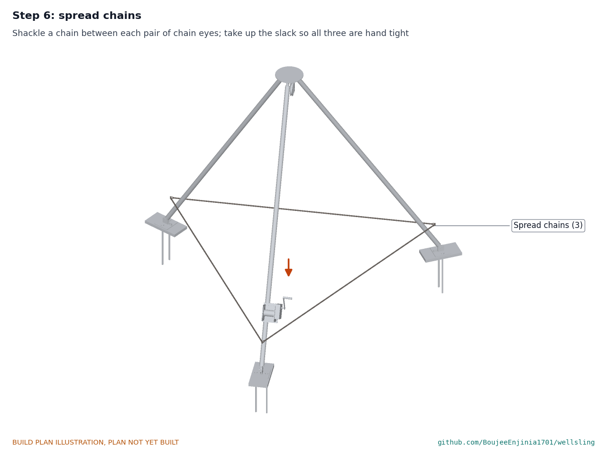

*Figure 33. Step 6: a spread chain between each pair of feet.*

Shackle a chain between each pair of chain eyes and take out the slack so all three are hand tight. Mouse the shackle pins.

### Step 7: rope reeved and hook on

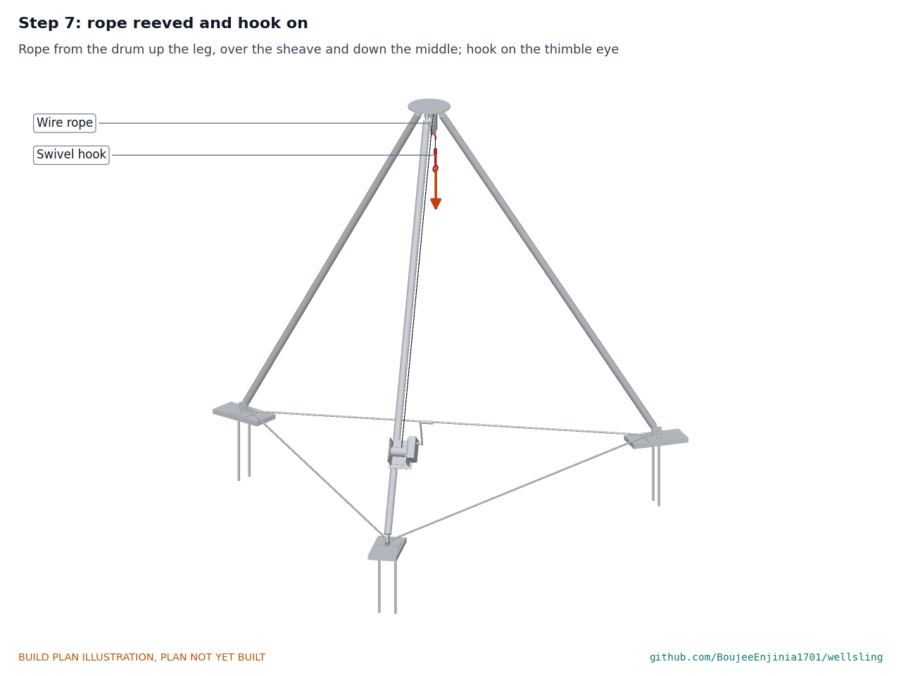

*Figure 34. Step 7: rope up leg 1, over the sheave and down the middle; hook on.*

The rope is reeved on the ground, never by climbing the tripod: in step 5, before the tripod is walked up, lead the rope's eye end from the drum along leg 1, over the sheave and back down between the legs. Once the tripod stands, put the swivel hook on the thimble eye. Wind until the hook hangs about 1 m above the ground.

### Step 8: spreader assembled

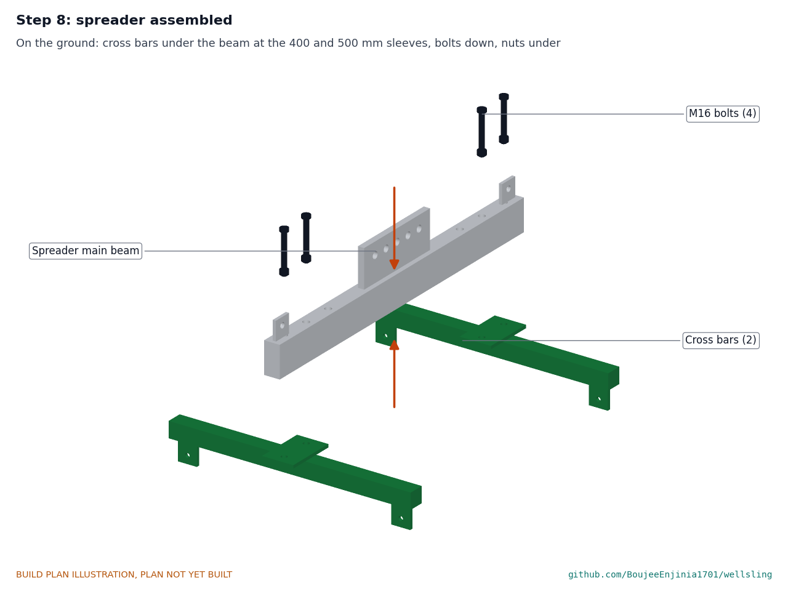

*Figure 35. Step 8: the cross bars bolted under the main beam, on the ground.*

On the ground, set each cross bar under the beam at the 400 and 500 mm sleeves and fit two M16 bolts down through the sleeves and top plate, with washers and nyloc nuts under the plate.

### Step 9: spreader on the hook

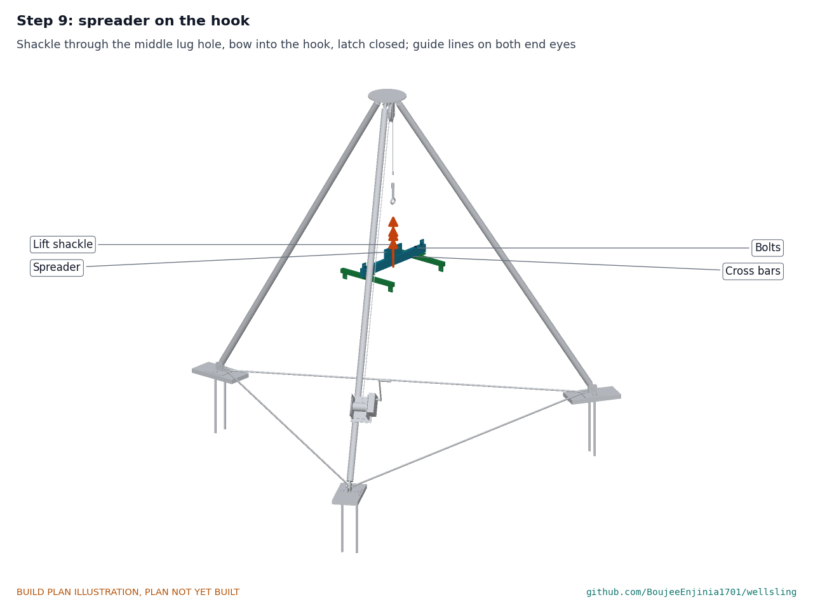

*Figure 36. Step 9: the spreader hung on the hook.*

Put the 3.25 t shackle through the middle hole of the lift lug, set its bow in the hook and close the latch. Tie a guide line to each end eye.

**Hold point.** Latch closed; shackle pin moused; guide lines tied.

### Step 10: bands, chains and sleeves

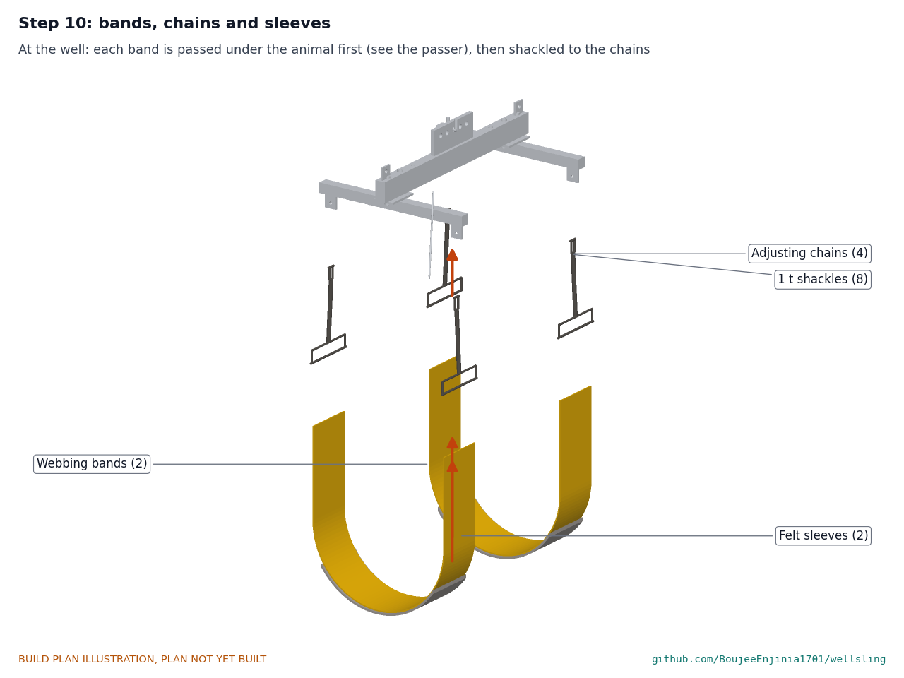

*Figure 37. Step 10: adjusting chains, shackles, bands and felt sleeves.*

Shackle an adjusting chain to each tip lug. At a well, each band (with its felt sleeve on) is first pulled under the animal on the messenger line, then its two eyes are shackled to the chains of one cross bar. For the first assembly, hang the bands empty. Set the chain length so the bands hang straight down from the tips.

### Step 11: rim bearers

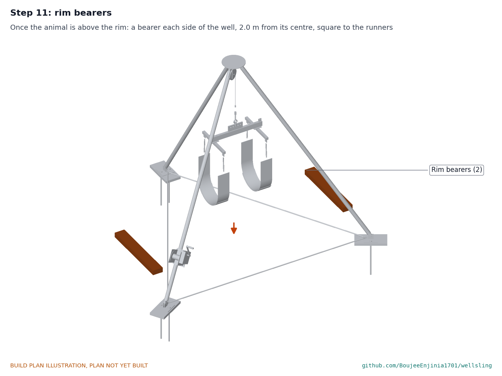

*Figure 38. Step 11: a rim bearer on each side of the well.*

At a well, this is done only once the animal's hooves are above the rim. Lay a bearer on each side of the well, its centre 2.0 m from the well's centre and square to the line the runners will take, near edge at least 350 mm back from the rim.

### Step 12: runners slid across

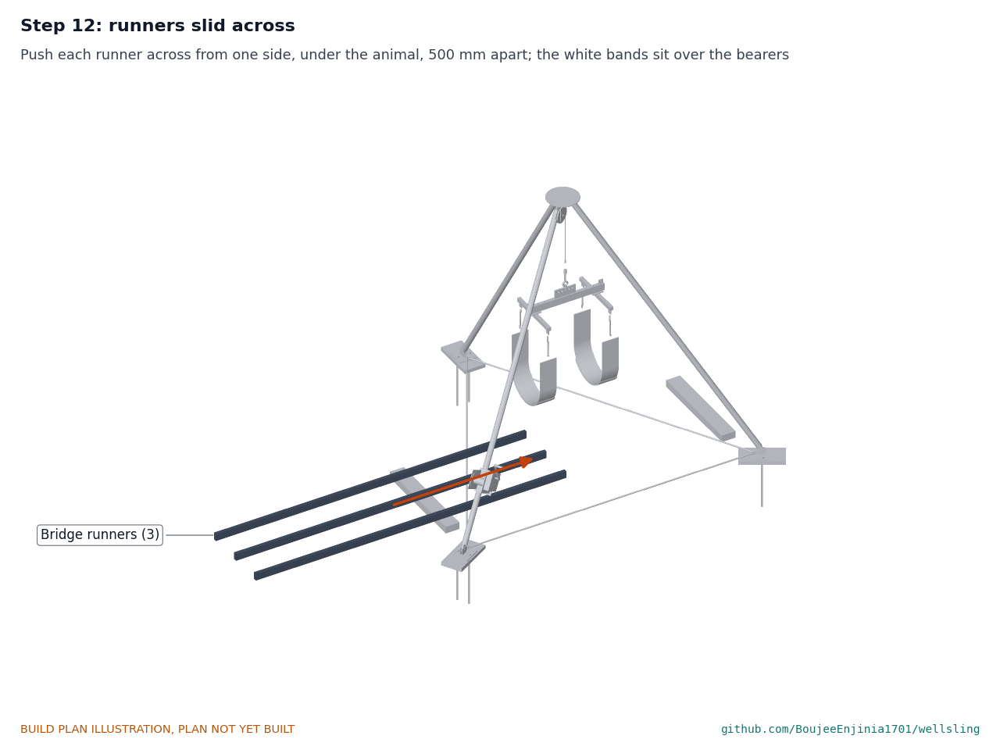

*Figure 39. Step 12: the three runners pushed across on the bearers.*

Push each runner across from one side, along the ground and over both bearers, 500 mm apart on the marks, with the white bands just inside the bearers. At a well, this is done from the side, under the held animal, never from the far side across the rim.

### Step 13: deck panels

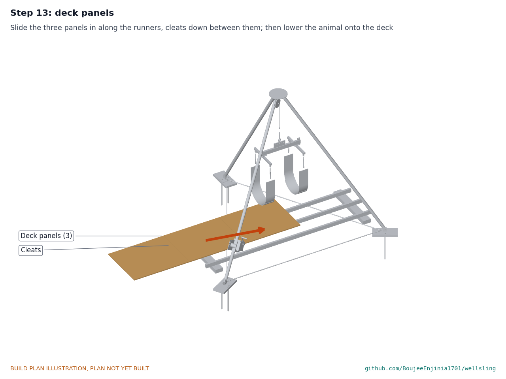

*Figure 40. Step 13: the three deck panels slid in along the runners.*

Slide the panels in along the runners, battens down between them, until all three meet end to end. At a well, the animal is then lowered onto the deck with the winch, the bands are slackened and unshackled, and it is led off.

### Step 14: passer pole made up

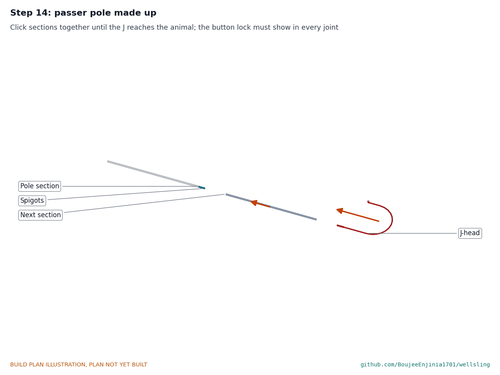

*Figure 41. Step 14: pole sections clicked together, J-head on the end.*

Click the J-head onto one section and add sections until the J reaches the animal. Every button must show in its hole. Make up the second pole with the retrieval hook head the same way.

## 5. First checks

These checks are listed for the TRL 4 test report; none is done in this plan.

*Table 2. First checks.*

| # | Check | Requirement | Pass when |
| --- | --- | --- | --- |
| 1 | Fit: every pin, bolt and shackle goes in by hand | R13 | No forcing; all six leg pins and both cross bar bolt pairs fit |
| 2 | Setup drill by three people on a marked circle | R6 | Ready to lift in 20 minutes or less |
| 3 | Brake hold: lift a 648 kg test weight 300 mm and let go of the handle | R7 | The load holds at three heights, no creep in 5 minutes |
| 4 | Proof load: 972 kg (1.5 times the hook load) held for 10 minutes, hook line vertical | R2 | No permanent set in any leg, pin or lug; feet do not move |
| 5 | Lean: 648 kg with the hook line pulled 10 deg in the worst direction | R10 | No foot lifts; spread chains stay tight |
| 6 | Crank force with a spring balance on the handle at 648 kg | R11 | 250 N or less |
| 7 | Passer: pass both bands under a 600 kg dummy in a test pit, from the rim | R1, R4 | Both bands in place, nobody below the rim |
| 8 | Landing: lift the dummy, slide in the bridge, lower it | R12, R5 | Hooves clear the deck by 150 mm; bearers 350 mm or more from the rim |
| 9 | Briefing: first-time operators complete a dummy lift after a 15-minute briefing | R8 | Lift completed with no safety stop broken |

## 6. Safety stops

*Table 3. Safety stops.*

| Stop | Before | What must be true to carry on |
| --- | --- | --- |
| S1 | Raising the tripod (step 5) | All six pins in and clipped; foot ropes manned; nobody inside the legs or under the head |
| S2 | Any load on the hook | Every stake driven, every spread chain tight and moused, every shackle moused, hook latch closed, the winch brake tested empty |
| S3 | First use with a real animal | The proof load (first check 4) passed and recorded in a TRL 4 test report; until then, test weights or dummies only |
| S4 | Starting a lift at a well | Nobody below the rim, now or at any time; pads and bearers set back as stated; anyone within 1 m of the rim in a harness tied back to a foot; a person in the well is a call to the emergency services, never a reason to go down |
| S5 | Lifting | Nobody under the load, inside the legs, or in line with a loaded rope or chain; the hook line kept within 10 deg of vertical; the crank turned steadily, and the handle let go only to rest on the brake |
| S6 | Sliding in the bridge | Hooves at least 150 mm above where the deck will be; the load held on the brake; runners pushed from the side, nobody reaching under the animal |
| S7 | Lowering onto the deck | The deck complete, cleats down, all three panels on; people clear of the animal's legs |

## 7. Tools, skills and workspace

- A fabrication shop with a band saw or cut-off saw, a pillar drill to 28 mm, a stick welder and a jig table at least 4.6 m long for the legs. A competent welder makes the head, the lift lug and the legs.
- A tube former or bending block for the J-head and hook head.
- A hot-dip galvaniser for all steel parts, and a sewing machine for heavy canvas.
- Hand tools: sledge for the stakes, spanners for M12 and M16, pliers and soft wire for mousing, a 5 m and a 30 m tape, chalk line and pegs for setting out.
- An open, level yard at least 12 m across for the first assembly, and a crew of four.
- A proof-load test (TRL 4) needs certified test weights or a calibrated load cell and a competent lifting inspector.

## 8. Where the numbers come from

- Parametric model and constructability checks: `cad/src/model.py`; assembly in `cad/step/wellsling-assembly.step`.
- General arrangement: `cad/drawings/WSL-DWG-001`; making sketches `cad/drawings/WSL-DWG-101` to `WSL-DWG-115`; pictures from `cad/src/build_plan_media.py`.
- Calculations: `docs/04-calcs/01-sizing.md` (WSL-CAL-001) and `docs/04-calcs/sizing.py`.
- Parts and costs: `bom/bom.csv`.
- Design changes: `docs/decisions/0002-design-for-construction.md` (WSL-DDR-002).
